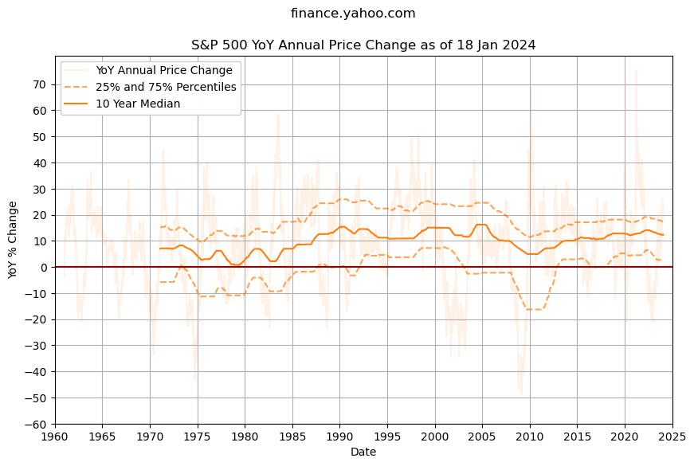
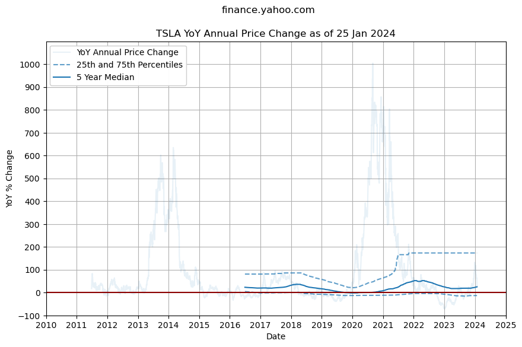

This project was created to provide some guidelines and forecasts for the following questions:

- How much do I need to retire? 
- How much will inflation or interest rates affect my retirement portfolio, both before and during retirement? 
- How much do I need in my investment portfolio today in order to have accrued enough to retire in the future? 

## [Inflation and Interest Rates](inflation-and-interest-rates.md)

## [S&P 500 Index](spx.md)

## [Tesla (TSLA)](tsla.md)

## Made in Australia

This project plots inflation and interest rates from the Reserve Bank of Australia with the SPX 500 index to help visualize investment and retirement portfolios for people living in Australia.

🚧 This experimental project is still in development.

### Disclaimer

Not financial advice: All content is for educational purposes only. No warranty or guarantee or forward looking statements of fit for purpose; do your own research, etc.