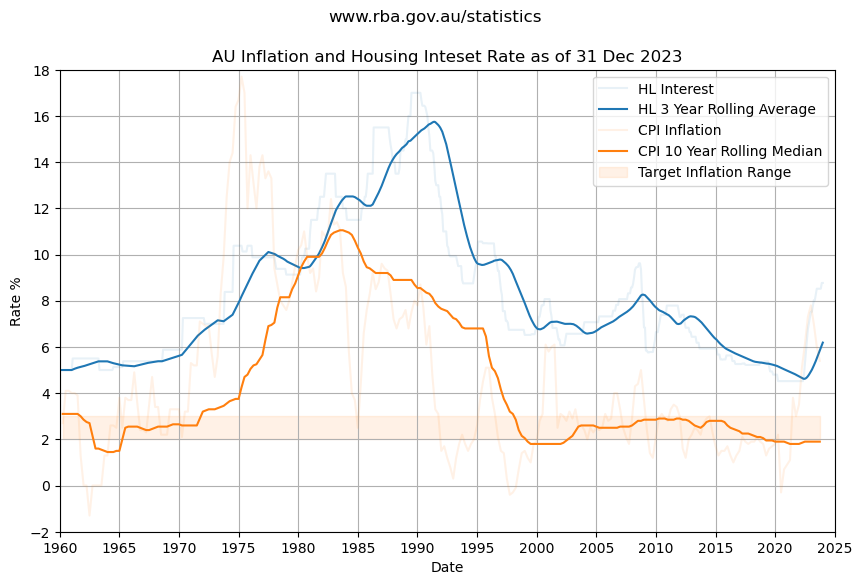

The Consumer Price Index that the Reserve Bank of Australia use to index inflation rocketed through the roof in the 1970s peaking at 18% in 1975. 

Since the mid 1990s inflation has been reasonably stable, staying close to the RBA target inflation rate of 2 to 3 percent for over twenty five years.

> The data suggests reasonable confidence using a baseline inflation of 2% to 3% with some uncertainty or risk that inflation could peak higher.

## Chart Data

See Jupyter Notebook [inflation-and-interest-rates.ipynb](https://github.com/mikejonestechno/investment-analytics/blob/main/notebooks/inflation-and-interest-rates.ipynb).

### Disclaimer

Not financial advice: All content is for educational purposes only. No warranty or guarantee or forward looking statements of fit for purpose; do your own research, etc.