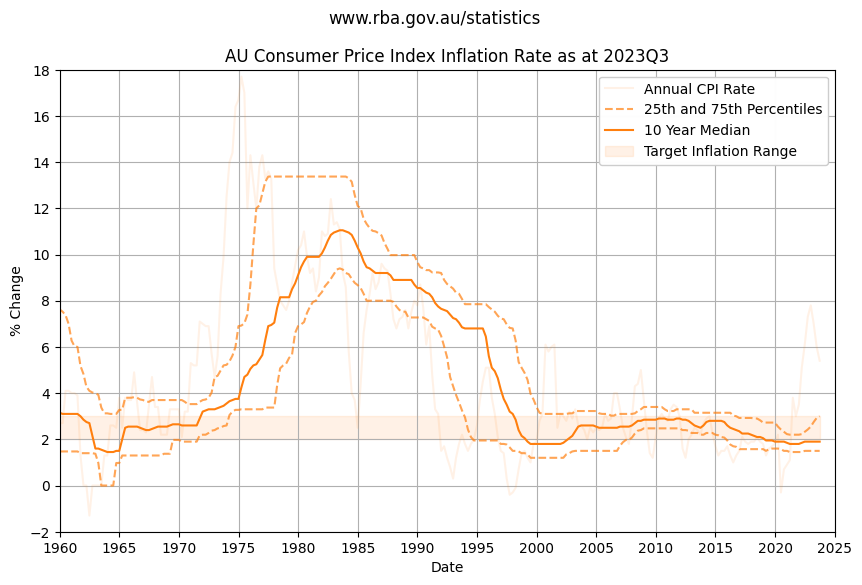

The Consumer Price Index that the Reserve Bank of Australia use to index inflation rocketed through the roof in the 1970s peaking at 18% in 1975. 

Since the mid 1990s inflation has been reasonably stable, slightly trending down until sharp rise in 2021.

Plotting the 25th and 75th percentile over multi-year time horizon helps visualize long term trends, and shows inflation stayed close to the RBA target inflation rate of 2 to 3 percent for over twenty five years.

Over a ten year time horizon the median inflation rate is 1.9%

- 25th percentile YoY change is 1.5%
- 50th percentile YoY change is 1.9%
- 75th percentile YoY change is 3.0%

Over the last 30 years:

- 25th percentile YoY change is 1.7%
- 50th percentile YoY change is 2.4%
- 75th percentile YoY change is 3.12%

> ℹ The data suggests reasonable confidence using a baseline inflation of 2% to 2.5% with some uncertainty or risk that inflation could peak higher.

## Chart Data

See Jupyter Notebook [inflation.ipynb](https://github.com/mikejonestechno/investment-analytics/blob/main/notebooks/inflation.ipynb).
