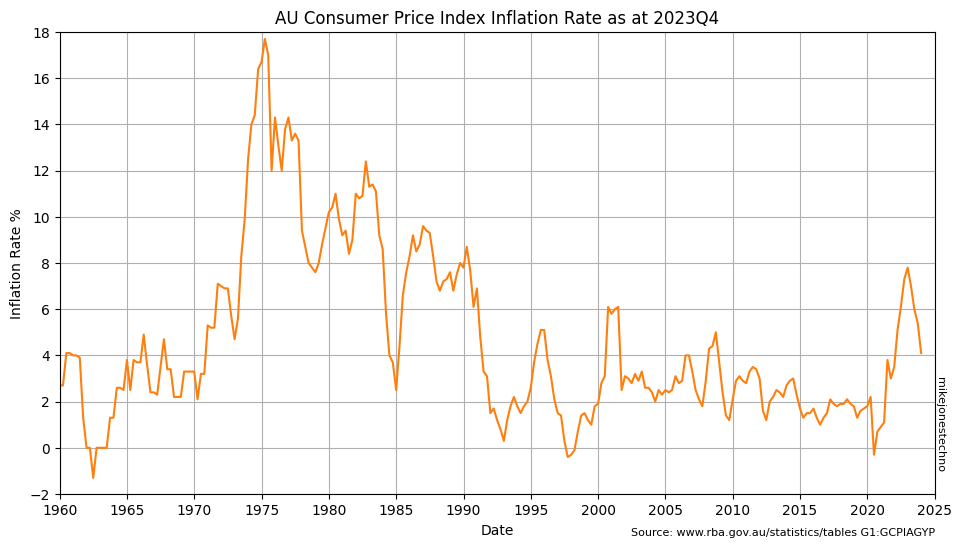
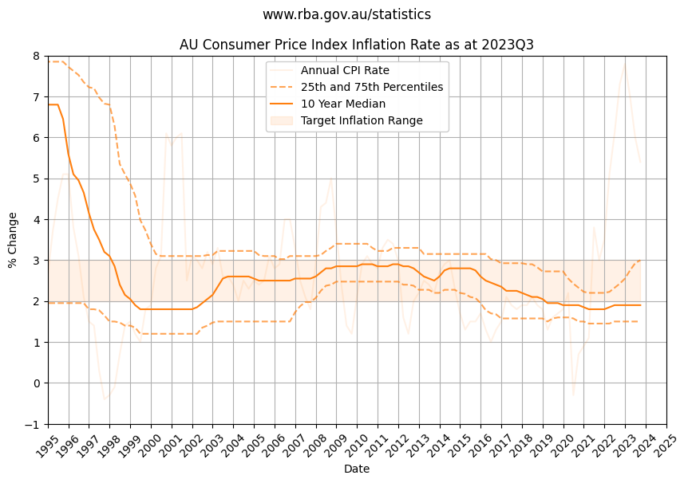

The Consumer Price Index that the Reserve Bank of Australia use to index inflation is published quarterly, one month after the end of each quarter.

Inflation rocketed through the roof in the 1970s peaking at 18% in 1975. 

Inflation remained highly volatile but eventually stabilized through the 1990s, and was trending slightly down through the 2000s until the spike back up to 8% at the end of 2022.

    

    

Calculating the 25th and 75th percentile over a multi year time horizon helps smooth out the anomolies and visualize the lower and upper long term trends.
    

    

    

Over the last 5 years the median (50th percetile) inflation rate is 3.25%.

Over the last 30 years the median (50th percetile) inflation rate is 2.45%.
    

<table id="T_dfdab">
  <thead>
    <tr>
      <th class="blank level0" >&nbsp;</th>
      <th id="T_dfdab_level0_col0" class="col_heading level0 col0" >25th percentile</th>
      <th id="T_dfdab_level0_col1" class="col_heading level0 col1" >50th percentile</th>
      <th id="T_dfdab_level0_col2" class="col_heading level0 col2" >75th percentile</th>
    </tr>
    <tr>
      <th class="index_name level0" >Years</th>
      <th class="blank col0" >&nbsp;</th>
      <th class="blank col1" >&nbsp;</th>
      <th class="blank col2" >&nbsp;</th>
    </tr>
  </thead>
  <tbody>
    <tr>
      <th id="T_dfdab_level0_row0" class="row_heading level0 row0" >1</th>
      <td id="T_dfdab_row0_col0" class="data row0 col0" >5.08</td>
      <td id="T_dfdab_row0_col1" class="data row0 col1" >5.70</td>
      <td id="T_dfdab_row0_col2" class="data row0 col2" >6.25</td>
    </tr>
    <tr>
      <th id="T_dfdab_level0_row1" class="row_heading level0 row1" >5</th>
      <td id="T_dfdab_row1_col0" class="data row1 col0" >1.53</td>
      <td id="T_dfdab_row1_col1" class="data row1 col1" >3.25</td>
      <td id="T_dfdab_row1_col2" class="data row1 col2" >5.55</td>
    </tr>
    <tr>
      <th id="T_dfdab_level0_row2" class="row_heading level0 row2" >10</th>
      <td id="T_dfdab_row2_col0" class="data row2 col0" >1.50</td>
      <td id="T_dfdab_row2_col1" class="data row2 col1" >1.90</td>
      <td id="T_dfdab_row2_col2" class="data row2 col2" >3.12</td>
    </tr>
    <tr>
      <th id="T_dfdab_level0_row3" class="row_heading level0 row3" >20</th>
      <td id="T_dfdab_row3_col0" class="data row3 col0" >1.77</td>
      <td id="T_dfdab_row3_col1" class="data row3 col1" >2.40</td>
      <td id="T_dfdab_row3_col2" class="data row3 col2" >3.15</td>
    </tr>
    <tr>
      <th id="T_dfdab_level0_row4" class="row_heading level0 row4" >30</th>
      <td id="T_dfdab_row4_col0" class="data row4 col0" >1.70</td>
      <td id="T_dfdab_row4_col1" class="data row4 col1" >2.45</td>
      <td id="T_dfdab_row4_col2" class="data row4 col2" >3.23</td>
    </tr>
  </tbody>
</table>

    

    

The chart shows inflation stayed close to the RBA target inflation rate of 2 to 3 percent for over twenty five years.

> ℹ The data suggests high confidence using a baseline inflation of 2.5% with some uncertainty or risk that inflation could peak higher.
