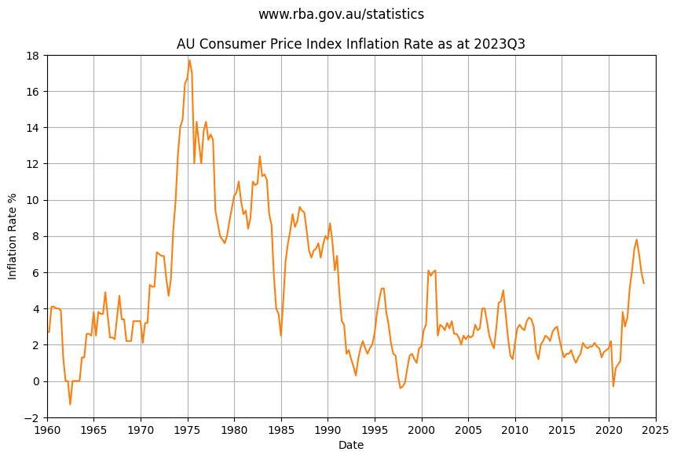
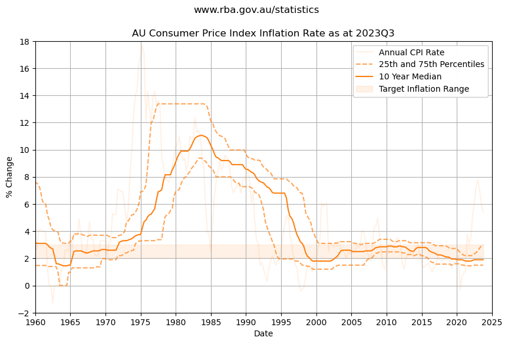

    Data from 2023Q4 not yet published...
    Use last published data from 2023Q3
    publish_date: 2023-10-31 00:00:00 was 83 days ago.
    Using local file

<table border="1" class="dataframe">
  <thead>
    <tr style="text-align: right;">
      <th></th>
      <th>Series ID</th>
      <th>GCPIAG</th>
      <th>GCPIAGYP</th>
      <th>GCPIEITCYP</th>
      <th>GCPIXVIYP</th>
      <th>GCPITIYP</th>
      <th>GCPITXVIYP</th>
      <th>GCPINTIYP</th>
      <th>GCPINTXDLYP</th>
      <th>GCPIOCPMWMYP</th>
      <th>...</th>
      <th>GCPIAGSAQP</th>
      <th>GCPIEITCQP</th>
      <th>GCPIXVIQP</th>
      <th>GCPITIQP</th>
      <th>GCPITXVIQP</th>
      <th>GCPINTIQP</th>
      <th>GCPINTXDLQP</th>
      <th>GCPIOCPMWMQP</th>
      <th>GCPIOCPMTMQP</th>
      <th>Unnamed: 21</th>
    </tr>
    <tr>
      <th>Date</th>
      <th></th>
      <th></th>
      <th></th>
      <th></th>
      <th></th>
      <th></th>
      <th></th>
      <th></th>
      <th></th>
      <th></th>
      <th></th>
      <th></th>
      <th></th>
      <th></th>
      <th></th>
      <th></th>
      <th></th>
      <th></th>
      <th></th>
      <th></th>
      <th></th>
    </tr>
  </thead>
  <tbody>
    <tr>
      <th>2022-06-30</th>
      <td>Jun-2022</td>
      <td>126.1</td>
      <td>6.1</td>
      <td>6.1</td>
      <td>5.3</td>
      <td>8.0</td>
      <td>5.1</td>
      <td>5.3</td>
      <td>5.3</td>
      <td>4.4</td>
      <td>...</td>
      <td>1.9</td>
      <td>1.9</td>
      <td>1.7</td>
      <td>2.3</td>
      <td>1.8</td>
      <td>1.7</td>
      <td>1.7</td>
      <td>1.4</td>
      <td>1.6</td>
      <td>NaN</td>
    </tr>
    <tr>
      <th>2022-09-30</th>
      <td>Sep-2022</td>
      <td>128.4</td>
      <td>7.3</td>
      <td>7.3</td>
      <td>6.7</td>
      <td>8.7</td>
      <td>6.9</td>
      <td>6.5</td>
      <td>6.5</td>
      <td>5.0</td>
      <td>...</td>
      <td>1.7</td>
      <td>1.7</td>
      <td>1.9</td>
      <td>1.4</td>
      <td>1.8</td>
      <td>2.0</td>
      <td>2.0</td>
      <td>1.4</td>
      <td>1.8</td>
      <td>NaN</td>
    </tr>
    <tr>
      <th>2022-12-31</th>
      <td>Dec-2022</td>
      <td>130.8</td>
      <td>7.8</td>
      <td>7.8</td>
      <td>7.6</td>
      <td>8.7</td>
      <td>8.1</td>
      <td>7.4</td>
      <td>7.4</td>
      <td>5.8</td>
      <td>...</td>
      <td>1.9</td>
      <td>1.9</td>
      <td>2.1</td>
      <td>1.8</td>
      <td>2.3</td>
      <td>1.9</td>
      <td>1.9</td>
      <td>1.6</td>
      <td>1.7</td>
      <td>NaN</td>
    </tr>
    <tr>
      <th>2023-03-31</th>
      <td>Mar-2023</td>
      <td>132.6</td>
      <td>7.0</td>
      <td>7.0</td>
      <td>7.3</td>
      <td>6.1</td>
      <td>6.7</td>
      <td>7.5</td>
      <td>7.5</td>
      <td>5.8</td>
      <td>...</td>
      <td>1.3</td>
      <td>1.3</td>
      <td>1.5</td>
      <td>0.6</td>
      <td>0.8</td>
      <td>1.7</td>
      <td>1.7</td>
      <td>1.2</td>
      <td>1.2</td>
      <td>NaN</td>
    </tr>
    <tr>
      <th>2023-06-30</th>
      <td>Jun-2023</td>
      <td>133.7</td>
      <td>6.0</td>
      <td>6.0</td>
      <td>6.5</td>
      <td>4.4</td>
      <td>5.8</td>
      <td>6.9</td>
      <td>6.9</td>
      <td>5.4</td>
      <td>...</td>
      <td>1.0</td>
      <td>1.0</td>
      <td>1.0</td>
      <td>0.8</td>
      <td>1.0</td>
      <td>1.1</td>
      <td>1.1</td>
      <td>1.0</td>
      <td>1.0</td>
      <td>NaN</td>
    </tr>
    <tr>
      <th>2023-09-30</th>
      <td>Sep-2023</td>
      <td>135.3</td>
      <td>5.4</td>
      <td>5.4</td>
      <td>5.5</td>
      <td>3.7</td>
      <td>4.1</td>
      <td>6.2</td>
      <td>6.2</td>
      <td>5.2</td>
      <td>...</td>
      <td>1.0</td>
      <td>1.0</td>
      <td>0.8</td>
      <td>0.4</td>
      <td>-0.2</td>
      <td>1.3</td>
      <td>1.3</td>
      <td>1.3</td>
      <td>1.2</td>
      <td>NaN</td>
    </tr>
  </tbody>
</table>

6 rows × 22 columns

The Consumer Price Index that the Reserve Bank of Australia use to index inflation rocketed through the roof in the 1970s peaking at 18% in 1975. 

Since the mid 1990s inflation has been reasonably stable, slightly trending down until sharp rise in 2021.

    

    

Plotting the 25th and 75th percentile over multi-year time horizon helps visualize long term trends, and shows inflation stayed close to the RBA target inflation rate of 2 to 3 percent for over twenty five years.

    Over the last 10 years
    25th percentile YoY change is 1.5%
    50th percentile YoY change is 1.9%
    75th percentile YoY change is 3.0%
    
    Over the last 30 years
    25th percentile YoY change is 1.7%
    50th percentile YoY change is 2.4%
    75th percentile YoY change is 3.12%

    Stored 'df_inflation' (DataFrame)

> ℹ The data suggests reasonable confidence using a baseline inflation of 2% to 2.5% with some uncertainty or risk that inflation could peak higher.

    

    

