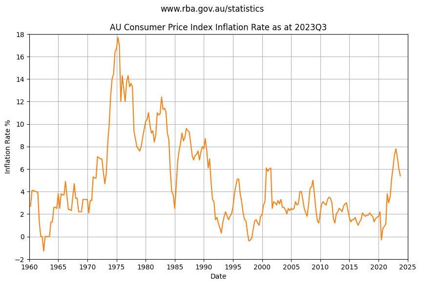

The Consumer Price Index that the Reserve Bank of Australia use to index inflation is published quarterly, one month after the end of each quarter.

Inflation rocketed through the roof in the 1970s peaking at 18% in 1975. 

Inflation remained highly volatile but eventually stabilized through the 1990s, then trends slightly down until the sharp rise in 2021.

    

    

Calculating the 25th and 75th percentile over multi-year time horizon helps visualize long term trends.

Over the last 10 years the median change is 1.9%:
- 25th percentile YoY change is 1.5%
- 50th percentile YoY change is 1.9%
- 75th percentile YoY change is 3.0%

Over the last 30 years:
- 25th percentile YoY change is 1.7%
- 50th percentile YoY change is 2.4%
- 75th percentile YoY change is 3.12%

The chart shows inflation stayed close to the RBA target inflation rate of 2 to 3 percent for over twenty five years.

> ℹ The data suggests reasonable confidence using a baseline inflation of 2% to 2.5% with some uncertainty or risk that inflation could peak higher.

    

    

