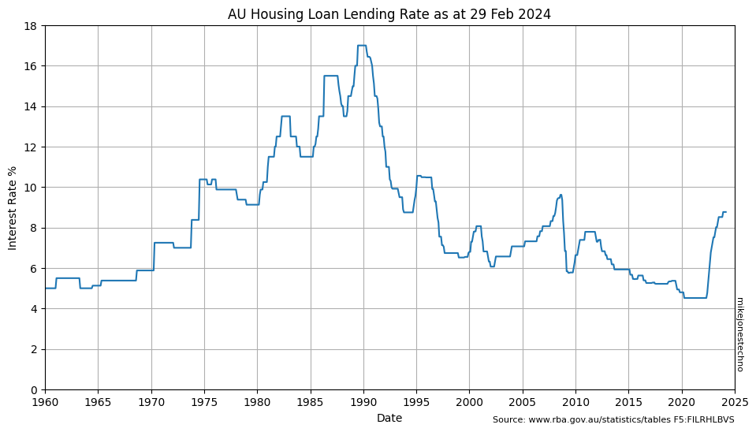
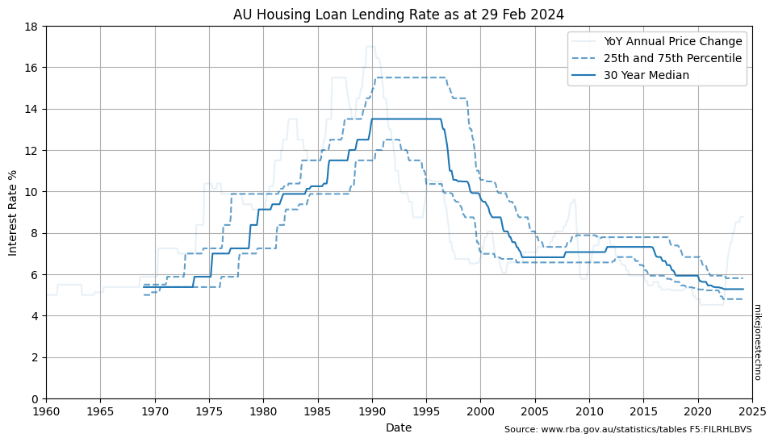

The Housing Loan Lending Rates are set by the Reserve Bank of Australia and published monthly within five business days after month end.

Australian interest rates ramped up from 6% in 1970 to a peak 17% in 1990 before dropping sharply back down to 10% in 1992.

Interest rates remained reasonably volatile with some sharp spikes and sudden drops, but overall trended down to 5% in 2020, before spiking back over 8% in 2023.

    

    

Calculating the 25th and 75th percentile over a multi year time horizon helps smooth out the anomolies and visualize the lower and upper long term trends.
    

    

    

Over the last 5 years the median (50th percetile) interest rate is 4.80%.

Over the last 30 years the median (50th percetile) interest rate is 6.74%.
    

<table id="T_02bf4">
  <thead>
    <tr>
      <th id="T_02bf4_level0_col0" class="col_heading level0 col0" >Years</th>
      <th id="T_02bf4_level0_col1" class="col_heading level0 col1" >25th percentile</th>
      <th id="T_02bf4_level0_col2" class="col_heading level0 col2" >50th percentile</th>
      <th id="T_02bf4_level0_col3" class="col_heading level0 col3" >75th percentile</th>
    </tr>
  </thead>
  <tbody>
    <tr>
      <td id="T_02bf4_row0_col0" class="data row0 col0" >1</td>
      <td id="T_02bf4_row0_col1" class="data row0 col1" >8.52</td>
      <td id="T_02bf4_row0_col2" class="data row0 col2" >8.52</td>
      <td id="T_02bf4_row0_col3" class="data row0 col3" >8.77</td>
    </tr>
    <tr>
      <td id="T_02bf4_row1_col0" class="data row1 col0" >5</td>
      <td id="T_02bf4_row1_col1" class="data row1 col1" >4.52</td>
      <td id="T_02bf4_row1_col2" class="data row1 col2" >4.80</td>
      <td id="T_02bf4_row1_col3" class="data row1 col3" >7.52</td>
    </tr>
    <tr>
      <td id="T_02bf4_row2_col0" class="data row2 col0" >10</td>
      <td id="T_02bf4_row2_col1" class="data row2 col1" >4.80</td>
      <td id="T_02bf4_row2_col2" class="data row2 col2" >5.28</td>
      <td id="T_02bf4_row2_col3" class="data row2 col3" >5.81</td>
    </tr>
    <tr>
      <td id="T_02bf4_row3_col0" class="data row3 col0" >20</td>
      <td id="T_02bf4_row3_col1" class="data row3 col1" >5.28</td>
      <td id="T_02bf4_row3_col2" class="data row3 col2" >6.22</td>
      <td id="T_02bf4_row3_col3" class="data row3 col3" >7.43</td>
    </tr>
    <tr>
      <td id="T_02bf4_row4_col0" class="data row4 col0" >30</td>
      <td id="T_02bf4_row4_col1" class="data row4 col1" >5.76</td>
      <td id="T_02bf4_row4_col2" class="data row4 col2" >6.74</td>
      <td id="T_02bf4_row4_col3" class="data row4 col3" >7.79</td>
    </tr>
  </tbody>
</table>

    

    

The chart shows interst rates have trended down from 7% to below 5% over the last 20 years.

> ℹ The data suggests reasonable confidence using baseline interest rates around 6% with reasonable uncertainty or risk that interest rates could peak higher.
