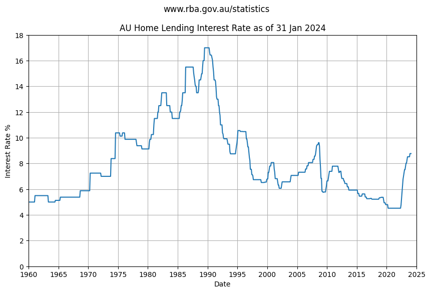

    publish_date: 2024-01-08 08:18:58.701469 was 10 days ago.
    Using local file

<table border="1" class="dataframe">
  <thead>
    <tr style="text-align: right;">
      <th></th>
      <th>Series ID</th>
      <th>FILRSBVRT</th>
      <th>FILRSBVOO</th>
      <th>FILRHLBVS</th>
      <th>FILRHLBVD</th>
      <th>FILRHLBVO</th>
      <th>FILRHL3YF</th>
      <th>FILRHLBVSI</th>
      <th>FILRHLBVDI</th>
      <th>FILRHLBVDO</th>
      <th>...</th>
      <th>FILRSAVIIO</th>
      <th>Unnamed: 31</th>
      <th>Unnamed: 32</th>
      <th>Unnamed: 33</th>
      <th>Unnamed: 34</th>
      <th>Unnamed: 35</th>
      <th>Unnamed: 36</th>
      <th>Unnamed: 37</th>
      <th>Unnamed: 38</th>
      <th>Unnamed: 39</th>
    </tr>
    <tr>
      <th>Date</th>
      <th></th>
      <th></th>
      <th></th>
      <th></th>
      <th></th>
      <th></th>
      <th></th>
      <th></th>
      <th></th>
      <th></th>
      <th></th>
      <th></th>
      <th></th>
      <th></th>
      <th></th>
      <th></th>
      <th></th>
      <th></th>
      <th></th>
      <th></th>
      <th></th>
    </tr>
  </thead>
  <tbody>
    <tr>
      <th>2023-07-31</th>
      <td>Jul-2023</td>
      <td>8.75</td>
      <td>10.51</td>
      <td>8.52</td>
      <td>7.06</td>
      <td>9.04</td>
      <td>6.65</td>
      <td>9.10</td>
      <td>7.50</td>
      <td>9.34</td>
      <td>...</td>
      <td>NaN</td>
      <td>NaN</td>
      <td>NaN</td>
      <td>NaN</td>
      <td>NaN</td>
      <td>NaN</td>
      <td>NaN</td>
      <td>NaN</td>
      <td>NaN</td>
      <td>NaN</td>
    </tr>
    <tr>
      <th>2023-08-31</th>
      <td>Aug-2023</td>
      <td>8.75</td>
      <td>10.51</td>
      <td>8.52</td>
      <td>7.06</td>
      <td>9.04</td>
      <td>6.58</td>
      <td>9.10</td>
      <td>7.50</td>
      <td>9.34</td>
      <td>...</td>
      <td>NaN</td>
      <td>NaN</td>
      <td>NaN</td>
      <td>NaN</td>
      <td>NaN</td>
      <td>NaN</td>
      <td>NaN</td>
      <td>NaN</td>
      <td>NaN</td>
      <td>NaN</td>
    </tr>
    <tr>
      <th>2023-09-30</th>
      <td>Sep-2023</td>
      <td>8.75</td>
      <td>10.51</td>
      <td>8.52</td>
      <td>7.06</td>
      <td>9.04</td>
      <td>6.56</td>
      <td>9.10</td>
      <td>7.50</td>
      <td>9.34</td>
      <td>...</td>
      <td>NaN</td>
      <td>NaN</td>
      <td>NaN</td>
      <td>NaN</td>
      <td>NaN</td>
      <td>NaN</td>
      <td>NaN</td>
      <td>NaN</td>
      <td>NaN</td>
      <td>NaN</td>
    </tr>
    <tr>
      <th>2023-10-31</th>
      <td>Oct-2023</td>
      <td>8.75</td>
      <td>10.51</td>
      <td>8.52</td>
      <td>7.06</td>
      <td>9.04</td>
      <td>6.56</td>
      <td>9.10</td>
      <td>7.50</td>
      <td>9.34</td>
      <td>...</td>
      <td>NaN</td>
      <td>NaN</td>
      <td>NaN</td>
      <td>NaN</td>
      <td>NaN</td>
      <td>NaN</td>
      <td>NaN</td>
      <td>NaN</td>
      <td>NaN</td>
      <td>NaN</td>
    </tr>
    <tr>
      <th>2023-11-30</th>
      <td>Nov-2023</td>
      <td>9.00</td>
      <td>10.69</td>
      <td>8.77</td>
      <td>7.31</td>
      <td>9.29</td>
      <td>6.80</td>
      <td>9.35</td>
      <td>7.75</td>
      <td>9.59</td>
      <td>...</td>
      <td>NaN</td>
      <td>NaN</td>
      <td>NaN</td>
      <td>NaN</td>
      <td>NaN</td>
      <td>NaN</td>
      <td>NaN</td>
      <td>NaN</td>
      <td>NaN</td>
      <td>NaN</td>
    </tr>
    <tr>
      <th>2023-12-31</th>
      <td>Dec-2023</td>
      <td>9.00</td>
      <td>10.69</td>
      <td>8.77</td>
      <td>7.31</td>
      <td>9.29</td>
      <td>6.80</td>
      <td>9.35</td>
      <td>7.75</td>
      <td>9.59</td>
      <td>...</td>
      <td>NaN</td>
      <td>NaN</td>
      <td>NaN</td>
      <td>NaN</td>
      <td>NaN</td>
      <td>NaN</td>
      <td>NaN</td>
      <td>NaN</td>
      <td>NaN</td>
      <td>NaN</td>
    </tr>
  </tbody>
</table>

6 rows × 40 columns

    

    

<table border="1" class="dataframe">
  <thead>
    <tr style="text-align: right;">
      <th></th>
      <th>Series ID</th>
      <th>FILRSBVRT</th>
      <th>FILRSBVOO</th>
      <th>FILRHLBVS</th>
      <th>FILRHLBVD</th>
      <th>FILRHLBVO</th>
      <th>FILRHL3YF</th>
      <th>FILRHLBVSI</th>
      <th>FILRHLBVDI</th>
      <th>FILRHLBVDO</th>
      <th>...</th>
      <th>Unnamed: 31</th>
      <th>Unnamed: 32</th>
      <th>Unnamed: 33</th>
      <th>Unnamed: 34</th>
      <th>Unnamed: 35</th>
      <th>Unnamed: 36</th>
      <th>Unnamed: 37</th>
      <th>Unnamed: 38</th>
      <th>Unnamed: 39</th>
      <th>3_yr_rolling</th>
    </tr>
    <tr>
      <th>Date</th>
      <th></th>
      <th></th>
      <th></th>
      <th></th>
      <th></th>
      <th></th>
      <th></th>
      <th></th>
      <th></th>
      <th></th>
      <th></th>
      <th></th>
      <th></th>
      <th></th>
      <th></th>
      <th></th>
      <th></th>
      <th></th>
      <th></th>
      <th></th>
      <th></th>
    </tr>
  </thead>
  <tbody>
    <tr>
      <th>2023-08-31</th>
      <td>Aug-2023</td>
      <td>8.75</td>
      <td>10.51</td>
      <td>8.52</td>
      <td>7.06</td>
      <td>9.04</td>
      <td>6.58</td>
      <td>9.10</td>
      <td>7.50</td>
      <td>9.34</td>
      <td>...</td>
      <td>NaN</td>
      <td>NaN</td>
      <td>NaN</td>
      <td>NaN</td>
      <td>NaN</td>
      <td>NaN</td>
      <td>NaN</td>
      <td>NaN</td>
      <td>NaN</td>
      <td>5.728333</td>
    </tr>
    <tr>
      <th>2023-09-30</th>
      <td>Sep-2023</td>
      <td>8.75</td>
      <td>10.51</td>
      <td>8.52</td>
      <td>7.06</td>
      <td>9.04</td>
      <td>6.56</td>
      <td>9.10</td>
      <td>7.50</td>
      <td>9.34</td>
      <td>...</td>
      <td>NaN</td>
      <td>NaN</td>
      <td>NaN</td>
      <td>NaN</td>
      <td>NaN</td>
      <td>NaN</td>
      <td>NaN</td>
      <td>NaN</td>
      <td>NaN</td>
      <td>5.839444</td>
    </tr>
    <tr>
      <th>2023-10-31</th>
      <td>Oct-2023</td>
      <td>8.75</td>
      <td>10.51</td>
      <td>8.52</td>
      <td>7.06</td>
      <td>9.04</td>
      <td>6.56</td>
      <td>9.10</td>
      <td>7.50</td>
      <td>9.34</td>
      <td>...</td>
      <td>NaN</td>
      <td>NaN</td>
      <td>NaN</td>
      <td>NaN</td>
      <td>NaN</td>
      <td>NaN</td>
      <td>NaN</td>
      <td>NaN</td>
      <td>NaN</td>
      <td>5.950556</td>
    </tr>
    <tr>
      <th>2023-11-30</th>
      <td>Nov-2023</td>
      <td>9.00</td>
      <td>10.69</td>
      <td>8.77</td>
      <td>7.31</td>
      <td>9.29</td>
      <td>6.80</td>
      <td>9.35</td>
      <td>7.75</td>
      <td>9.59</td>
      <td>...</td>
      <td>NaN</td>
      <td>NaN</td>
      <td>NaN</td>
      <td>NaN</td>
      <td>NaN</td>
      <td>NaN</td>
      <td>NaN</td>
      <td>NaN</td>
      <td>NaN</td>
      <td>6.068611</td>
    </tr>
    <tr>
      <th>2023-12-31</th>
      <td>Dec-2023</td>
      <td>9.00</td>
      <td>10.69</td>
      <td>8.77</td>
      <td>7.31</td>
      <td>9.29</td>
      <td>6.80</td>
      <td>9.35</td>
      <td>7.75</td>
      <td>9.59</td>
      <td>...</td>
      <td>NaN</td>
      <td>NaN</td>
      <td>NaN</td>
      <td>NaN</td>
      <td>NaN</td>
      <td>NaN</td>
      <td>NaN</td>
      <td>NaN</td>
      <td>NaN</td>
      <td>6.186667</td>
    </tr>
  </tbody>
</table>

5 rows × 41 columns

    Stored 'df_interest' (DataFrame)

