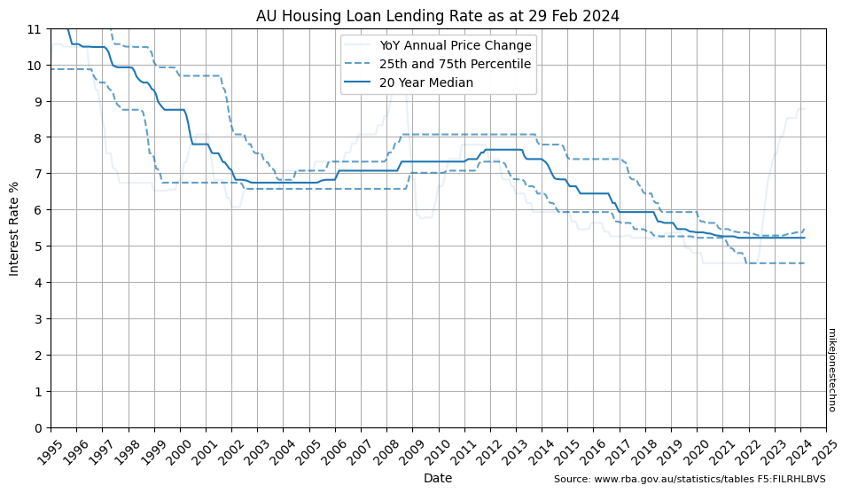

The Housing Loan Lending Rates are set by the Reserve Bank of Australia and published monthly within five business days after month end.

Australian interest rates ramped up from 6% in 1970 to a peak 17% in 1990 before dropping sharply back down to 10% in 1992.

Interest rates remained reasonably volatile with some sharp spikes and sudden drops, but overall trended down to 5% in 2020, before spiking back over 8% in 2023.

    

    

Calculating the 25th and 75th percentile over a multi year time horizon helps smooth out the anomolies and visualize the lower and upper long term trends.

    

    

Over the last 10 years the median (50th percetile) change is 5.28%.

Over the last 30 years the median (50th percetile) change is 6.74%.

| Years | 25th percentile | 50th percentile | 75th percentile |
|-------|-----:|-----:|-----:|
| 1     | 8.46 | 8.52 | 8.77 |
| 10    | 4.80 | 5.28 | 5.81 |
| 20    | 5.28 | 6.22 | 7.39 |
| 30    | 5.76 | 6.74 | 7.79 |

    

    

The chart shows interst rates have trended down from 7% to below 6% over the last 20 years.

> ℹ The data suggests reasonable confidence using baseline interest rates between 6% to 7% with reasonable uncertainty or risk that interest rates could peak higher.
