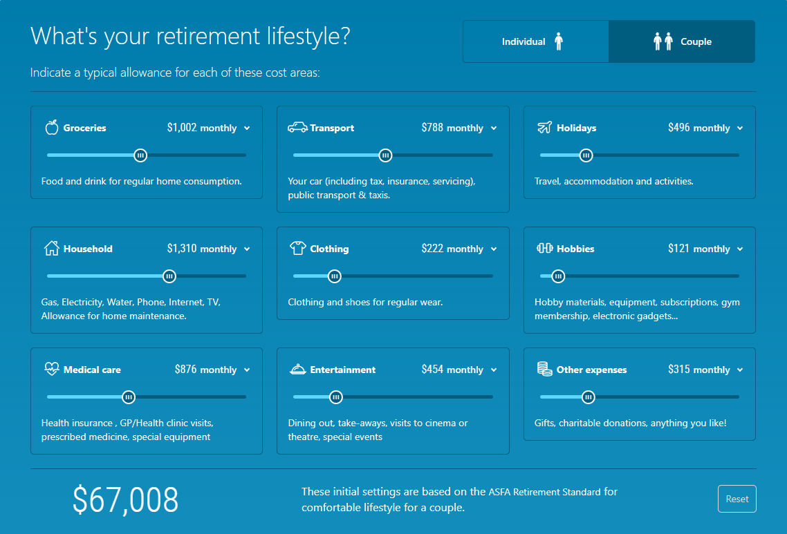

# Retirement Planning

The Association of Superannuation Funds of Australia Limited ASFA is the largest policy, research and advocacy body for the superanuation (pension) industry; a non-profit advisor to the Australian government.

ASFA have published a "standard" listing of how much money is required each year for a "comfortable" retirement. The figures are based on their original 2018 research data (subsequently adjusted for inflation each quarter).

- [Retirement Standard - ASFA (superannuation.asn.au)](https://www.superannuation.asn.au/resources/retirement-standard#DetailedBreakdowns)

- [Retirement calculator - how much will you need for retirement?](https://www.bt.com.au/personal/your-finances/retirement/retirement-calculator.html)

The model estimates how much the average Australian individual or couple would spend each year (in today's dollars) on each listed expense category to live a "comfortable" lifestyle in retirement.

They define a "comfortable" lifestyle enables a retiree to be involved in a broad range of leisure and recreational activities and to have a good standard of living through the purchase of things such as household goods, private health insurance, a reasonable car, good clothes, a range of electronic equipment, and domestic and occasionally international holiday travel. It assumes you own your own home and are reasonably healthy.

## Retirement Lifestyles

The "comfortable" retirement should be used as minimum baseline. Its reasonably "good" but is not luxurious.

The "modest" retirement is a borderline survival level, with basic and limited expenses, cheap old car, and a "need to keep close watch on utility costs and make sacrifices".

I extended the model with additional levels factored at 200%, 300% and 500% of the "modest" lifestyle.

| Couple  | Modest  | Comfortable | Four Star | Luxury   | Opulent  |
|---------|--------:|------------:|----------:|---------:|---------:|
| Annual  | $45,808 |     $70,482 |   $91,616 | $137,424 | $229,040 |
| Monthly | $3,817  |      $5,874 |    $7,635 |  $11,452 |  $19,087 |
| Diff    | 100%    |        150% |      200% |     300% |     500% |

"Luxury" lifestyle could include for example, economy upgrade to business class, the "opulent" lifestyle is first class.

The models assume you own your own home so take any additional mortgage expenses into account.

## Misleading Data

> ⚠ WARNING: CHOICE say the ASFA Retirement Standard is misleading.
>
>"The expert view is that these standards may be misleading (too high). The Productivity Commission said these standards equate to a retirement income that is 'more than many people spend _before_ retirement', and that they are "no more than an arbitrary benchmark that should be ignored in policymaking".
>
> Source: [CHOICE: How much do you really need to retire?](https://www.choice.com.au/money/financial-planning-and-investing/superannuation/articles/our-new-retirement-standards)

### My Take

> I believe the ASFA could be a useful benchmark, subject to validation with *actual* personal expenses. Personalized data will tend to be more accurate than a generalized model.

While true that many people may be on a "modest" lifestyle _before_ retirement, my *actual* expenses show the "comfortable" lifestyle is reasonably close to our current standard of living (less mortgage); the ASFA model appears reasonably acurate for a baseline model. 

## Improving Accuracy and Assumptions

The ASFA standard is based on their 2018 research that they regularly adjust for inflation. It appears that a generic average inflation is applied, so the model could be more accurate if each category was adjusted separately, given cost of some goods can increase significantly while other expenses remain stable.

>"All figures in today’s dollars using 2.75% AWE as a deflator and an assumed investment earning rate of 6 per cent. The fact that the same savings are required for both couples and singles reflects the impact of receiving the Age Pension."

The ASFA standard has a split for individuals and couples, and for those aged over 85 which they assume will have much less international flights and entertainment expenses, but higher medical expenses. It's unclear to me how these absolute values are determined and what the real expense curves may look like.

It's also unfortunate that the model attempts to calculate precise absolute values instead of a range of values with probability of those values.

Imagine that the ASFA forecasts of absolute values are out by +/- 20% to form a standard distribution range of values. Some expense categories could be forecast to greater degree of accuracy than others.

A monte carlo simulation could provide more reliable ranges of expense probability forecasts rather than the absolute values provided by the standard model.

When costs do increase, some categories such as food are more essential than entertainment and holidays so its not clear to me how accurate the category weighting is for the lifestyles and if it could be modelled more accurately.

> There is opportunity to develop a more accurate modelling of expenses, although based on my own *actual* expenses, the ASFA appears reasonably accurate for an initial baseline model.
