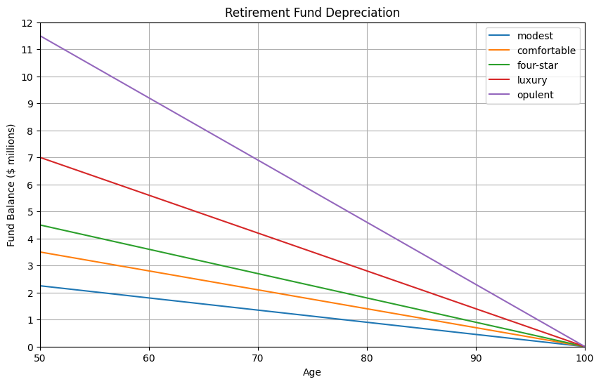
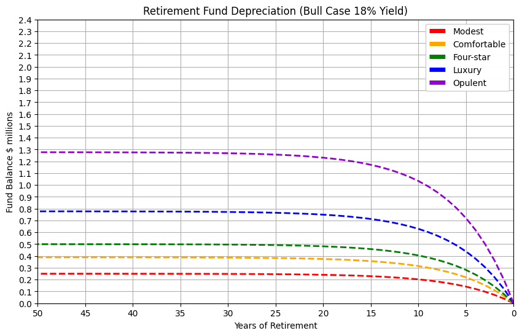

## How much do I need to retire?

There are two primary components:

- How much are my annual expenses?
- How many years of retirement?

These two components help resolve the original question:

- Will I have enough superannuation fund to cover these expenses during retirement?

## Retirement Expenses

This data model is based on annual retirement expense data from the [Association of Superannuation Funds of Australia](retirement-planning.md). Expenses are plotted for different 'lifestyle' scenarios:

| Lifestyle | Modest | Comfortable | Four-star | Luxury | Opulent |
|-----------|--:|--:|--:|--:|--:|
| Annual    | $45,000| $70,000| $90,000| $140,000| $230,000 |
| Monthly   | $3,800| $5,800| $7,500| $11,700| $19,200 |

The chart below shows the cumulative retirement expenses for up to 50 years of retirement:

    

    

This model excludes inflation, the true funds required would be much higher as expenses will increase over time. 

Even a modest retirement requires at least a million dollars of expenses. Hopefully superanuation can pay for these expenses.

## Superanuation Returns and Performance

Lets start a bear case with a retirement fund yield or appreciation of 10.0% per year.:

<table border="1" class="dataframe">
  <thead>
    <tr style="text-align: right;">
      <th></th>
      <th>comfortable_initial</th>
      <th>comfortable_yield</th>
      <th>comfortable_eoy</th>
      <th>comfortable_expenses</th>
      <th>comfortable_balance</th>
    </tr>
  </thead>
  <tbody>
    <tr>
      <th>0</th>
      <td>63636.363636</td>
      <td>6363.636364</td>
      <td>70000</td>
      <td>-70000</td>
      <td>0</td>
    </tr>
    <tr>
      <th>1</th>
      <td>121487.603306</td>
      <td>12148.760331</td>
      <td>133636.363636</td>
      <td>-70000</td>
      <td>63636.363636</td>
    </tr>
    <tr>
      <th>2</th>
      <td>174079.639369</td>
      <td>17407.963937</td>
      <td>191487.603306</td>
      <td>-70000</td>
      <td>121487.603306</td>
    </tr>
    <tr>
      <th>3</th>
      <td>221890.581244</td>
      <td>22189.058124</td>
      <td>244079.639369</td>
      <td>-70000</td>
      <td>174079.639369</td>
    </tr>
    <tr>
      <th>4</th>
      <td>265355.073859</td>
      <td>26535.507386</td>
      <td>291890.581244</td>
      <td>-70000</td>
      <td>221890.581244</td>
    </tr>
  </tbody>
</table>

    

    

    | Years | Lower | Median | Upper |
    |-------|-----:|-----:|-----:|
    | 1     | 5.85 | 6.50 | 7.20 |
    | 10    | 1.50 | 1.90 | 3.00 |
    | 30    | 1.70 | 2.40 | 3.12 |
    

    0.024

<table border="1" class="dataframe">
  <thead>
    <tr style="text-align: right;">
      <th></th>
      <th>year</th>
      <th>age</th>
      <th>Modest</th>
      <th>Comfortable</th>
      <th>Four-star</th>
      <th>Luxury</th>
      <th>Opulent</th>
      <th>modest_lower_inflation</th>
      <th>modest_lower_balance</th>
      <th>modest_median_inflation</th>
      <th>...</th>
      <th>luxury_median_inflation</th>
      <th>luxury_median_balance</th>
      <th>luxury_upper_inflation</th>
      <th>luxury_upper_balance</th>
      <th>opulent_lower_inflation</th>
      <th>opulent_lower_balance</th>
      <th>opulent_median_inflation</th>
      <th>opulent_median_balance</th>
      <th>opulent_upper_inflation</th>
      <th>opulent_upper_balance</th>
    </tr>
  </thead>
  <tbody>
    <tr>
      <th>0</th>
      <td>50</td>
      <td>100</td>
      <td>0</td>
      <td>0</td>
      <td>0</td>
      <td>0</td>
      <td>0</td>
      <td>0.000000</td>
      <td>-0.000000</td>
      <td>0.00000</td>
      <td>...</td>
      <td>0.00000</td>
      <td>-0.00000</td>
      <td>0.000000</td>
      <td>-0.000000</td>
      <td>0.00000</td>
      <td>-0.00000</td>
      <td>0.00000</td>
      <td>-0.00000</td>
      <td>0.000000</td>
      <td>-0.000000</td>
    </tr>
    <tr>
      <th>1</th>
      <td>49</td>
      <td>99</td>
      <td>45000</td>
      <td>70000</td>
      <td>90000</td>
      <td>140000</td>
      <td>230000</td>
      <td>-45000.000000</td>
      <td>45000.000000</td>
      <td>-45000.00000</td>
      <td>...</td>
      <td>-140000.00000</td>
      <td>140000.00000</td>
      <td>-140000.000000</td>
      <td>140000.000000</td>
      <td>-230000.00000</td>
      <td>230000.00000</td>
      <td>-230000.00000</td>
      <td>230000.00000</td>
      <td>-230000.000000</td>
      <td>230000.000000</td>
    </tr>
    <tr>
      <th>2</th>
      <td>48</td>
      <td>98</td>
      <td>90000</td>
      <td>140000</td>
      <td>180000</td>
      <td>280000</td>
      <td>460000</td>
      <td>-45765.000000</td>
      <td>90765.000000</td>
      <td>-46080.00000</td>
      <td>...</td>
      <td>-143360.00000</td>
      <td>283360.00000</td>
      <td>-144368.000000</td>
      <td>284368.000000</td>
      <td>-233910.00000</td>
      <td>463910.00000</td>
      <td>-235520.00000</td>
      <td>465520.00000</td>
      <td>-237176.000000</td>
      <td>467176.000000</td>
    </tr>
    <tr>
      <th>3</th>
      <td>47</td>
      <td>97</td>
      <td>135000</td>
      <td>210000</td>
      <td>270000</td>
      <td>420000</td>
      <td>690000</td>
      <td>-46543.005000</td>
      <td>137308.005000</td>
      <td>-47185.92000</td>
      <td>...</td>
      <td>-146800.64000</td>
      <td>430160.64000</td>
      <td>-148872.281600</td>
      <td>433240.281600</td>
      <td>-237886.47000</td>
      <td>701796.47000</td>
      <td>-241172.48000</td>
      <td>706692.48000</td>
      <td>-244575.891200</td>
      <td>711751.891200</td>
    </tr>
    <tr>
      <th>4</th>
      <td>46</td>
      <td>96</td>
      <td>180000</td>
      <td>280000</td>
      <td>360000</td>
      <td>560000</td>
      <td>920000</td>
      <td>-47334.236085</td>
      <td>184642.241085</td>
      <td>-48318.38208</td>
      <td>...</td>
      <td>-150323.85536</td>
      <td>580484.49536</td>
      <td>-153517.096786</td>
      <td>586757.378386</td>
      <td>-241930.53999</td>
      <td>943727.00999</td>
      <td>-246960.61952</td>
      <td>953653.09952</td>
      <td>-252206.659005</td>
      <td>963958.550205</td>
    </tr>
  </tbody>
</table>

5 rows × 37 columns

    

    

