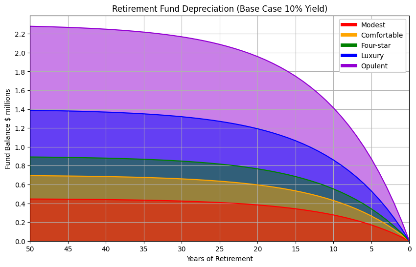
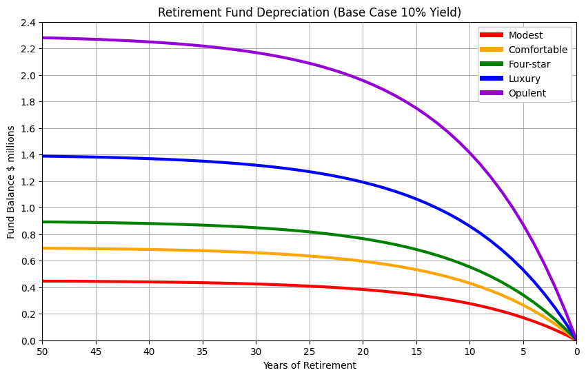

## How much do I need to retire?

There are two primary components:

- How much are my annual expenses?
- How many years of retirement?

These two components help resolve the original question:

- Will I have enough superannuation fund to cover these expenses during retirement?

## Retirement Expenses

This data model is based on annual retirement expense data from the [Association of Superannuation Funds of Australia](retirement-planning.md). Expenses are plotted for different 'lifestyle' scenarios:

| Lifestyle | Modest | Comfortable | Four-star | Luxury | Opulent |
|-----------|--:|--:|--:|--:|--:|
| Annual    | $45,000| $70,000| $90,000| $140,000| $230,000 |
| Monthly   | $3,800| $5,800| $7,500| $11,700| $19,200 |

The chart below shows the cumulative retirement expenses for up to 50 years of retirement:

    

    

The cumulative expenses show even a modest retirement requires millions of dollars. 

These straight line plots exclude inflation, so the true funds required would be much higher as expenses will increase over time. Inflation will be added to the model in a later stage.

A retirement fund will need to earn enough annual returns to pay for these annual expenses.

## Superanuation Returns and Performance

Long term Australian superannuation fund performance has been analysed by [superguide.com.au](https://www.superguide.com.au/comparing-super-funds/super-funds-returns-financial-year). Over a 15 year time period, the median performing superannuation fund (with a 'growth' risk portfolio) increases 7.8% per year. 

The median performing 'growth' risk funds should at least be able to match the baseline performance of the S&P 500 index. High performing funds and those with a 'high growth' risk portfolio should be expected to out-perform the S&P 500 index by selecting a subset of high performing companies, and investing in a small set of high growth, high risk stocks.

> ℹ Over a 30 year time period the S&P 500 index has a median increase of 12% per year.

### Example Base Case
                 
Assume a retirement fund with a yield or appreciation of 10% per year.

A retirement fund of $700,000 will increase by $70,000 per year, 
enough to cover the comfortable lifestyle annual expenses of $70,000 per year, every year.

A retirement fund slightly less than $700,000 will gradually decrease in value over time and eventually reach zero.

### Base Case

    

    

Long term fund performance is important because short term performance can fluctuate with global ecomonic trends and international stock market volatility.

A fund that has consistently better or worse performance over a multi-year period will have a significant impact - if consistently sustained over that long time period.

## Bull Case

As seen above, a fund of $700,000 with a base return of 10% could support a comfortable retirement for 50 years. A high performing fund with a consistent return of 18% could could jump two lifestyle levels and support a near-luxury retirement for 50 years.

    

    

The chart below illustrates the overlapping lifestyle curves at different peformance levels. Generally a sustained high performing return will move up one lifestyle curve, and a sustained low performing return will move down one lifestyle curve.

These expenses still do not take inflation into consideration, however the fund performance is the greatest factor in determining retirement income.

    

    

## Inflation

The Reserve Bank of Australia use the Consumer Price Index to track inflation. Inflation was highly volatile through the 1970s but eventually stabilized and inflation has stayed close to the RBA target inflation rate of 2 to 3 percent for over twenty five years.

Here are the median (50th percentile) and lower and upper 25th percentiles over multi-year time periods:

| Years | Lower | Median | Upper |
|-------|-----:|-----:|-----:|
| 1     | 5.08 | 5.70 | 6.25 |
| 10    | 1.50 | 1.90 | 3.12 |
| 30    | 1.70 | 2.45 | 3.23 |

<table border="1" class="dataframe">
  <thead>
    <tr style="text-align: right;">
      <th></th>
      <th>year</th>
      <th>age</th>
      <th>Modest</th>
      <th>Comfortable</th>
      <th>Four-star</th>
      <th>Luxury</th>
      <th>Opulent</th>
      <th>modest_lower_inflation</th>
      <th>modest_lower_balance</th>
      <th>modest_median_inflation</th>
      <th>...</th>
      <th>luxury_median_inflation</th>
      <th>luxury_median_balance</th>
      <th>luxury_upper_inflation</th>
      <th>luxury_upper_balance</th>
      <th>opulent_lower_inflation</th>
      <th>opulent_lower_balance</th>
      <th>opulent_median_inflation</th>
      <th>opulent_median_balance</th>
      <th>opulent_upper_inflation</th>
      <th>opulent_upper_balance</th>
    </tr>
  </thead>
  <tbody>
    <tr>
      <th>0</th>
      <td>50</td>
      <td>100</td>
      <td>0</td>
      <td>0</td>
      <td>0</td>
      <td>0</td>
      <td>0</td>
      <td>0.000000</td>
      <td>-0.000000</td>
      <td>0.000000</td>
      <td>...</td>
      <td>0.000000</td>
      <td>-0.000000</td>
      <td>0.000000</td>
      <td>-0.000000</td>
      <td>0.00000</td>
      <td>-0.00000</td>
      <td>0.000000</td>
      <td>-0.000000</td>
      <td>0.000000</td>
      <td>-0.000000</td>
    </tr>
    <tr>
      <th>1</th>
      <td>49</td>
      <td>99</td>
      <td>45000</td>
      <td>70000</td>
      <td>90000</td>
      <td>140000</td>
      <td>230000</td>
      <td>-45000.000000</td>
      <td>45000.000000</td>
      <td>-45000.000000</td>
      <td>...</td>
      <td>-140000.000000</td>
      <td>140000.000000</td>
      <td>-140000.000000</td>
      <td>140000.000000</td>
      <td>-230000.00000</td>
      <td>230000.00000</td>
      <td>-230000.000000</td>
      <td>230000.000000</td>
      <td>-230000.000000</td>
      <td>230000.000000</td>
    </tr>
    <tr>
      <th>2</th>
      <td>48</td>
      <td>98</td>
      <td>90000</td>
      <td>140000</td>
      <td>180000</td>
      <td>280000</td>
      <td>460000</td>
      <td>-45765.000000</td>
      <td>90765.000000</td>
      <td>-46102.500000</td>
      <td>...</td>
      <td>-143430.000000</td>
      <td>283430.000000</td>
      <td>-144522.000000</td>
      <td>284522.000000</td>
      <td>-233910.00000</td>
      <td>463910.00000</td>
      <td>-235635.000000</td>
      <td>465635.000000</td>
      <td>-237429.000000</td>
      <td>467429.000000</td>
    </tr>
    <tr>
      <th>3</th>
      <td>47</td>
      <td>97</td>
      <td>135000</td>
      <td>210000</td>
      <td>270000</td>
      <td>420000</td>
      <td>690000</td>
      <td>-46543.005000</td>
      <td>137308.005000</td>
      <td>-47232.011250</td>
      <td>...</td>
      <td>-146944.035000</td>
      <td>430374.035000</td>
      <td>-149190.060600</td>
      <td>433712.060600</td>
      <td>-237886.47000</td>
      <td>701796.47000</td>
      <td>-241408.057500</td>
      <td>707043.057500</td>
      <td>-245097.956700</td>
      <td>712526.956700</td>
    </tr>
    <tr>
      <th>4</th>
      <td>46</td>
      <td>96</td>
      <td>180000</td>
      <td>280000</td>
      <td>360000</td>
      <td>560000</td>
      <td>920000</td>
      <td>-47334.236085</td>
      <td>184642.241085</td>
      <td>-48389.195526</td>
      <td>...</td>
      <td>-150544.163857</td>
      <td>580918.198857</td>
      <td>-154008.899557</td>
      <td>587720.960157</td>
      <td>-241930.53999</td>
      <td>943727.00999</td>
      <td>-247322.554909</td>
      <td>954365.612409</td>
      <td>-253014.620701</td>
      <td>965541.577401</td>
    </tr>
  </tbody>
</table>

5 rows × 37 columns

    

    

