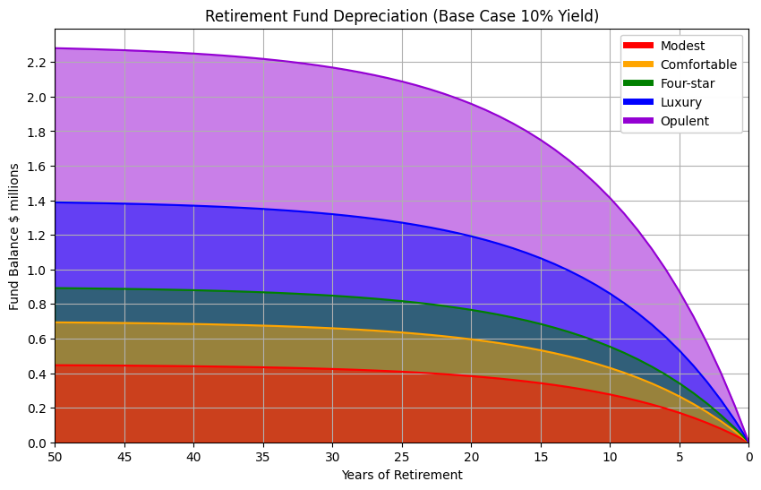
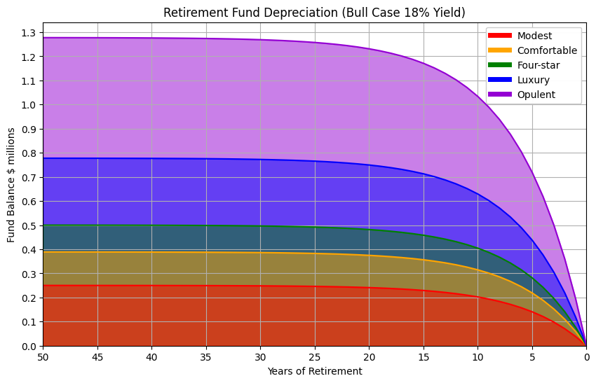
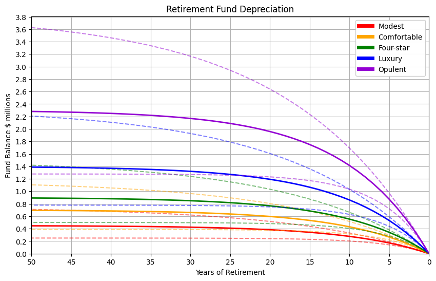
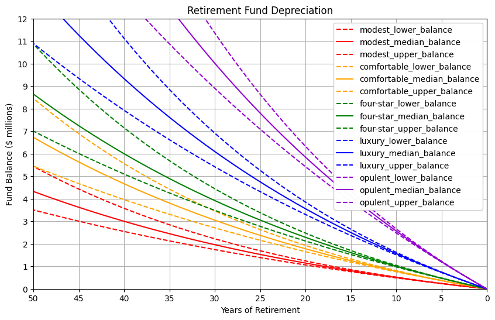

## How much do I need to retire?

There are two primary components:

- How much are my annual expenses?
- How many years of retirement?

These two components help resolve the original question:

- Will I have enough superannuation fund to cover these expenses during retirement?

## Retirement Expenses

This data model is based on annual retirement expense data from the [Association of Superannuation Funds of Australia](retirement-planning.md). Expenses are plotted for different 'lifestyle' scenarios:

| Lifestyle | Modest | Comfortable | Four-star | Luxury | Opulent |
|-----------|--:|--:|--:|--:|--:|
| Annual    | $45,000| $70,000| $90,000| $140,000| $230,000 |
| Monthly   | $3,800| $5,800| $7,500| $11,700| $19,200 |

The chart below shows the cumulative retirement expenses for up to 50 years of retirement:

    

    

This model excludes inflation, the true funds required would be much higher as expenses will increase over time. Inflation will be added to the model in a later stage.

Even a modest retirement requires millions of dollars of expenses. Hopefully superanuation can pay for these expenses.

## Superanuation Returns and Performance

Australian superannuation fund performance has been analysed by [superguide.com.au](https://www.superguide.com.au/comparing-super-funds/super-funds-returns-financial-year). Over a 15 year time period, the median performing superannuation fund (with a 'growth' risk portfolio) increased 7.8% per year. 

The median performing 'growth' risk funds should at least be able to match the baseline performance of the S&P 500 index. High performing funds and those with a 'high growth' risk portfolio should be expected to out-perform the S&P 500 index by selecting a subset of high performing companies, and investing in a small set of high growth, high risk stocks.

> ℹ Over a 30 year time period the S&P 500 index has a median increase of around 12% per year.

Lets start an example with a retirement fund yield or appreciation of 10% per year.

A retirement fund of $700,000 will increase by $70,000 per year, 
enough to cover the comfortable lifestyle annual expenses of $70,000 per year.

A retirement fund slightly less than $700,000 will decrease in value over time and eventually reach zero.

    

    

Superanuation fund performance can fluctuate year to year with international ecomonic trends and stock market volatility. A fund that has consistently better or worse performance over a multi-year period will have significant impact - if consistently sustained over that long time period.

A fund of $700,000 with a base return of 10% could support a comfortable retirement for 50 years. A high performing fund with a consistent return of 18% could could jump two lifestyle levels and support a near-luxury retirement for 50 years.

    

    

The chart below illustrates the overlapping lifestyle curves at different peformance levels. Generally a sustained high performing return will move up one lifestyle curve, and a sustained low performing return will move down one lifestyle curve.

These expenses still do not take inflation into consideration, however the fund performance is the greatest factor in determining retirement income.

    

    

## Inflation

    | Years | Lower | Median | Upper |
    |-------|-----:|-----:|-----:|
    | 1     | 5.08 | 5.70 | 6.25 |
    | 10    | 1.50 | 1.90 | 3.12 |
    | 30    | 1.70 | 2.45 | 3.23 |
    

    0.0245

    

    

