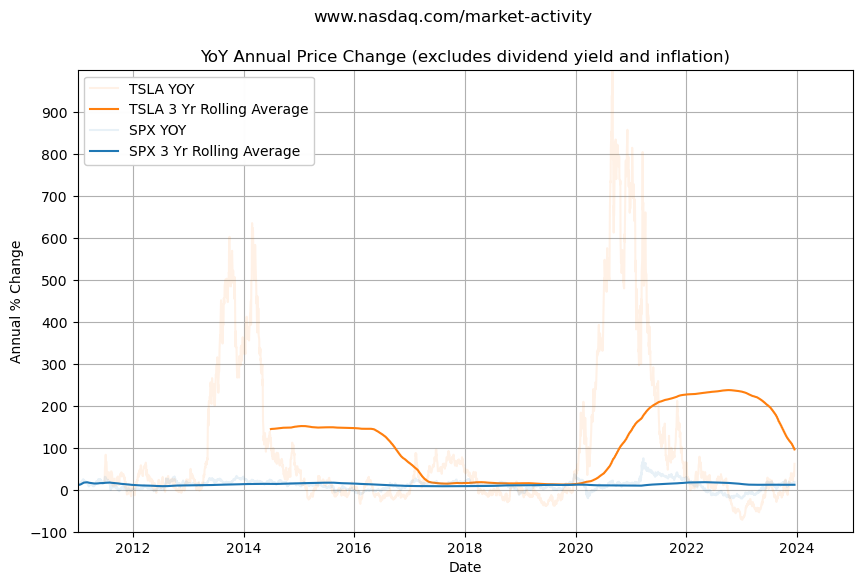

## SPX 500

This notebook imports SPX historical data from csv - rather than magic importing the dataframe from memory.

<table border="1" class="dataframe">
  <thead>
    <tr style="text-align: right;">
      <th></th>
      <th>Open</th>
      <th>High</th>
      <th>Low</th>
      <th>Close*</th>
      <th>Price</th>
      <th>Volume</th>
    </tr>
    <tr>
      <th>Date</th>
      <th></th>
      <th></th>
      <th></th>
      <th></th>
      <th></th>
      <th></th>
    </tr>
  </thead>
  <tbody>
    <tr>
      <th>2010-01-04</th>
      <td>1116.56</td>
      <td>1133.87</td>
      <td>1116.56</td>
      <td>1132.99</td>
      <td>1132.99</td>
      <td>3991400000</td>
    </tr>
    <tr>
      <th>2010-01-05</th>
      <td>1132.66</td>
      <td>1136.63</td>
      <td>1129.66</td>
      <td>1136.52</td>
      <td>1136.52</td>
      <td>2491020000</td>
    </tr>
    <tr>
      <th>2010-01-06</th>
      <td>1135.71</td>
      <td>1139.19</td>
      <td>1133.95</td>
      <td>1137.14</td>
      <td>1137.14</td>
      <td>4972660000</td>
    </tr>
    <tr>
      <th>2010-01-07</th>
      <td>1136.27</td>
      <td>1142.46</td>
      <td>1131.32</td>
      <td>1141.69</td>
      <td>1141.69</td>
      <td>5270680000</td>
    </tr>
    <tr>
      <th>2010-01-08</th>
      <td>1140.52</td>
      <td>1145.39</td>
      <td>1136.22</td>
      <td>1144.98</td>
      <td>1144.98</td>
      <td>4389590000</td>
    </tr>
  </tbody>
</table>

<table border="1" class="dataframe">
  <thead>
    <tr style="text-align: right;">
      <th></th>
      <th>Open</th>
      <th>High</th>
      <th>Low</th>
      <th>Close*</th>
      <th>Price</th>
      <th>Volume</th>
      <th>YoY Change</th>
      <th>3 Yr Rolling Avg</th>
    </tr>
    <tr>
      <th>Date</th>
      <th></th>
      <th></th>
      <th></th>
      <th></th>
      <th></th>
      <th></th>
      <th></th>
      <th></th>
    </tr>
  </thead>
  <tbody>
    <tr>
      <th>2023-12-11</th>
      <td>4593.39</td>
      <td>4623.71</td>
      <td>4593.39</td>
      <td>4622.44</td>
      <td>4622.44</td>
      <td>3823210000</td>
      <td>16.624911</td>
      <td>11.804009</td>
    </tr>
    <tr>
      <th>2023-12-12</th>
      <td>4618.30</td>
      <td>4643.93</td>
      <td>4608.09</td>
      <td>4643.70</td>
      <td>4643.70</td>
      <td>3808380000</td>
      <td>18.028762</td>
      <td>11.805042</td>
    </tr>
    <tr>
      <th>2023-12-13</th>
      <td>4646.20</td>
      <td>4709.69</td>
      <td>4643.23</td>
      <td>4707.09</td>
      <td>4707.09</td>
      <td>5063650000</td>
      <td>17.955625</td>
      <td>11.806626</td>
    </tr>
    <tr>
      <th>2023-12-14</th>
      <td>4721.04</td>
      <td>4738.57</td>
      <td>4694.34</td>
      <td>4719.55</td>
      <td>4719.55</td>
      <td>6314040000</td>
      <td>17.411964</td>
      <td>11.808998</td>
    </tr>
    <tr>
      <th>2023-12-15</th>
      <td>4714.23</td>
      <td>4725.53</td>
      <td>4704.69</td>
      <td>4719.19</td>
      <td>4719.19</td>
      <td>8218980000</td>
      <td>18.117948</td>
      <td>11.812982</td>
    </tr>
  </tbody>
</table>

# TSLA

<table border="1" class="dataframe">
  <thead>
    <tr style="text-align: right;">
      <th></th>
      <th>Price</th>
    </tr>
    <tr>
      <th>Date</th>
      <th></th>
    </tr>
  </thead>
  <tbody>
    <tr>
      <th>2010-06-29</th>
      <td>1.592667</td>
    </tr>
    <tr>
      <th>2010-06-30</th>
      <td>1.588667</td>
    </tr>
    <tr>
      <th>2010-07-01</th>
      <td>1.464000</td>
    </tr>
    <tr>
      <th>2010-07-02</th>
      <td>1.280000</td>
    </tr>
    <tr>
      <th>2010-07-06</th>
      <td>1.074000</td>
    </tr>
  </tbody>
</table>

<table border="1" class="dataframe">
  <thead>
    <tr style="text-align: right;">
      <th></th>
      <th>Price</th>
      <th>YoY Change</th>
      <th>3 Yr Rolling Avg</th>
    </tr>
    <tr>
      <th>Date</th>
      <th></th>
      <th></th>
      <th></th>
    </tr>
  </thead>
  <tbody>
    <tr>
      <th>2011-01-03</th>
      <td>1.774667</td>
      <td>NaN</td>
      <td>NaN</td>
    </tr>
    <tr>
      <th>2011-01-04</th>
      <td>1.778000</td>
      <td>NaN</td>
      <td>NaN</td>
    </tr>
    <tr>
      <th>2011-01-05</th>
      <td>1.788667</td>
      <td>NaN</td>
      <td>NaN</td>
    </tr>
    <tr>
      <th>2011-01-06</th>
      <td>1.858667</td>
      <td>NaN</td>
      <td>NaN</td>
    </tr>
    <tr>
      <th>2011-01-07</th>
      <td>1.882667</td>
      <td>NaN</td>
      <td>NaN</td>
    </tr>
  </tbody>
</table>

    

    

