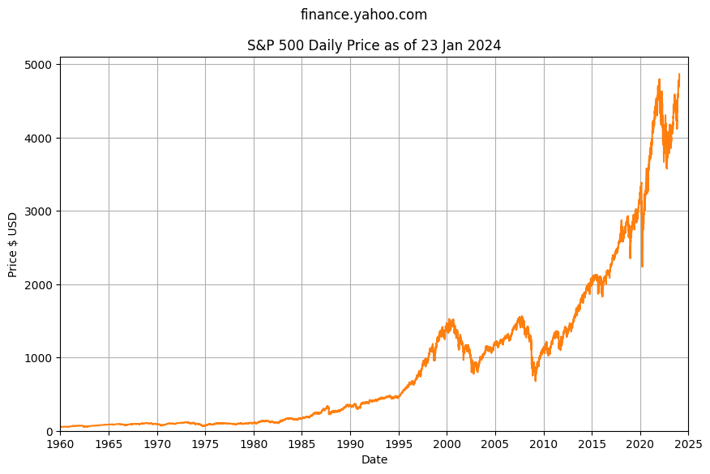
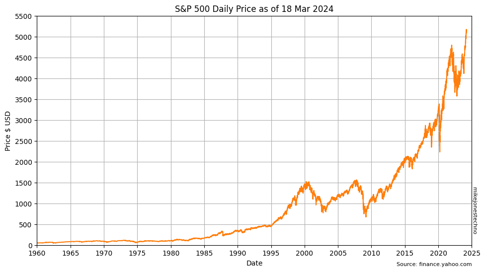
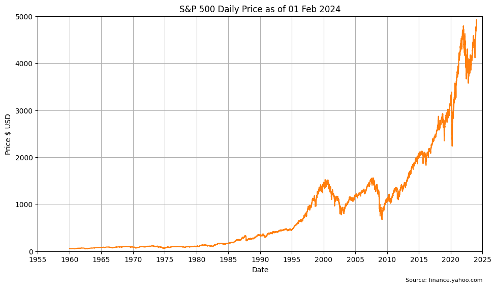

    Using local file

<table border="1" class="dataframe">
  <thead>
    <tr style="text-align: right;">
      <th></th>
      <th>Open</th>
      <th>High</th>
      <th>Low</th>
      <th>Close</th>
      <th>Adj Close</th>
      <th>Volume</th>
    </tr>
    <tr>
      <th>Date</th>
      <th></th>
      <th></th>
      <th></th>
      <th></th>
      <th></th>
      <th></th>
    </tr>
  </thead>
  <tbody>
    <tr>
      <th>1960-01-04</th>
      <td>59.910000</td>
      <td>59.910000</td>
      <td>59.910000</td>
      <td>59.910000</td>
      <td>59.910000</td>
      <td>3990000</td>
    </tr>
    <tr>
      <th>1960-01-05</th>
      <td>60.389999</td>
      <td>60.389999</td>
      <td>60.389999</td>
      <td>60.389999</td>
      <td>60.389999</td>
      <td>3710000</td>
    </tr>
    <tr>
      <th>1960-01-06</th>
      <td>60.130001</td>
      <td>60.130001</td>
      <td>60.130001</td>
      <td>60.130001</td>
      <td>60.130001</td>
      <td>3730000</td>
    </tr>
    <tr>
      <th>1960-01-07</th>
      <td>59.689999</td>
      <td>59.689999</td>
      <td>59.689999</td>
      <td>59.689999</td>
      <td>59.689999</td>
      <td>3310000</td>
    </tr>
    <tr>
      <th>1960-01-08</th>
      <td>59.500000</td>
      <td>59.500000</td>
      <td>59.500000</td>
      <td>59.500000</td>
      <td>59.500000</td>
      <td>3290000</td>
    </tr>
  </tbody>
</table>

    

    

    

    

    Over the last 10 years
    25th percentile YoY change is 2.67%
    50th percentile YoY change is 12.34%
    75th percentile YoY change is 17.39%
    
    Over the last 30 years
    25th percentile YoY change is 1.29%
    50th percentile YoY change is 11.49%
    75th percentile YoY change is 19.49%

    

    

