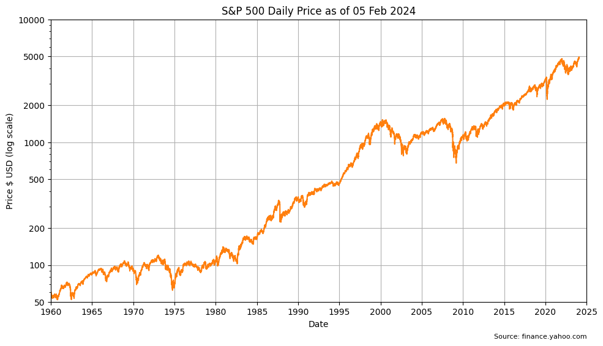
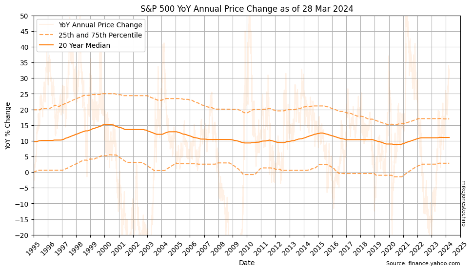
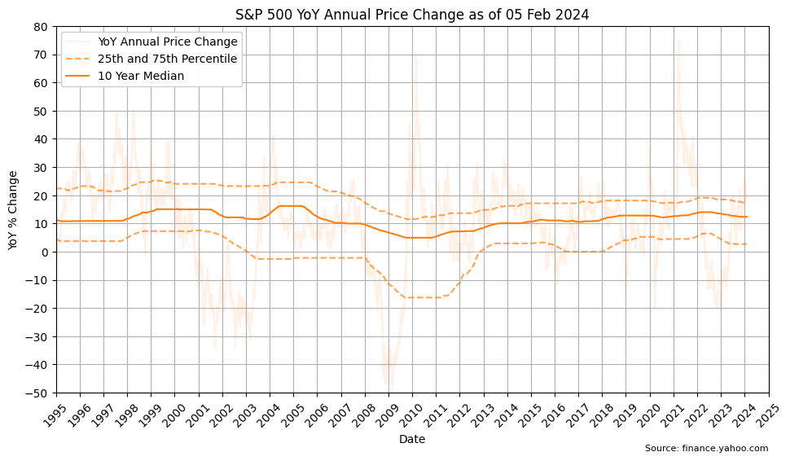

The S&P 500 Index from Standard & Poor's is a market-capitalization-weighted index tracking the 500 largest publicly traded companies in the US. 

The S&P 500 is widely considered one of the best gauges of overall stock market performance because of its depth and diversity, tracking the top performing companies by market capitalization.

    

    

The compound annual growth over time appears to be an exponential curve. Plotting the same data with a logarithmic y-axis scale helps visualize the bursts of growth in earlier years that would otherwise be hidden by the volatility of spikes in later years.

    

    

The logarithmic scale shows a period of volatility between 1965 and 1980 where the price was flat, trending very slightly up.

The sudden almost 45' angle from 1980 shows significant growth, climbing 10x over 20 years, from $100 in 1980 to over $1,000 in the year 2000. 

The S&P 500 hit a ten year period of volatility between 2000 and 2010 which wiped out almost 1/2 of the value at the lowest point.

Another 45' climb over the next 15 years resulted in another 5x from $1,000 in 2010 to $5,000 around 2025.

The logarithmic scale shows the S&P 500 has consistent multi-year periods of high growth performance (with flat sideways trends through periods of high volatility).

Calculating the 25th and 75th percentile over a multi-year time horizon helps smooth out the anomolies and visualize the lower and upper long term trends.

Over the last 10 years the median (50th percetile) change is 12.34%.

Over the last 30 years the median (50th percetile) change is 11.51%.

| Years | 25th percentile | 50th percentile | 75th percentile |
|-------|-----:|-----:|-----:|
| 1     | -0.50 | 12.06 | 16.36 |
| 10    | 2.67 | 12.34 | 17.39 |
| 30    | 1.29 | 11.51 | 19.55 |

    

    

> ℹ Given the multi-decade history, the data suggests high confidence using a baseline stock market performance of 12% with some uncertainty or risk that stocks can go up or down for several years at a time. Note this does not take inflation into consideration.

    

    

