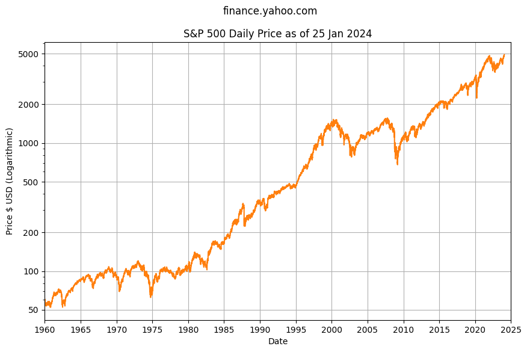

The S&P 500 Index from Standard & Poor's is a market-capitalization-weighted index tracking the 500 largest publicly traded companies in the US. 

The S&P 500 is widely considered one of the best gauges of overall stock market performance because of its depth and diversity, and because it tracks the top performing companies by market capitalization.

The compound annual growth over time appears to be an exponential curve. Plotting the same data with a logarithmic y-axis scale helps visualize the bursts of growth in earlier years that would otherwise be hidden by the volatility of spikes in later years.

The logarithmic scale shows the price was relatively flat between 1965 and 1980 before climbing 10x over 20 years from $100 in 1980 to $1,000 in the year 2000. 

The price was then highly volatile through major stock market crashes between 2000 and 2010 which wiped out almost 1/2 of the value, before finally recovering and climbing 5x over the next 15 years from $1,000 in 2010 to $5,000 around 2025.

The straight lines show the S&P 500 has consistent high growth performance (outside of multi-year volatility when it trends sideways).

Plotting the Year over Year annual price change helps visualize potential investment returns. The S&P has a lot of volatility between +40% and -20%, with occasional spikes outside this range.

Over a ten year time horizon the median YoY annual price change is 12.34%

- 25th percentile YoY change is 2.67%
- 50th percentile YoY change is 12.34%
- 75th percentile YoY change is 17.39%

Over the last thirty years the variation is slightly wider:

- 25th percentile YoY change is 1.29%
- 50th percentile YoY change is 11.49%
- 75th percentile YoY change is 19.49%

> ℹ Given the multi-decade history, the data suggests high confidence using a baseline stock market performance of 12% with some uncertainty or risk that stocks can go up or down for several years at a time. Note this does not take inflation into consideration.

## Chart Data

See Jupyter Notebook [spx-prices.ipynb](https://github.com/mikejonestechno/investment-analytics/blob/main/notebooks/spx-prices.ipynb).