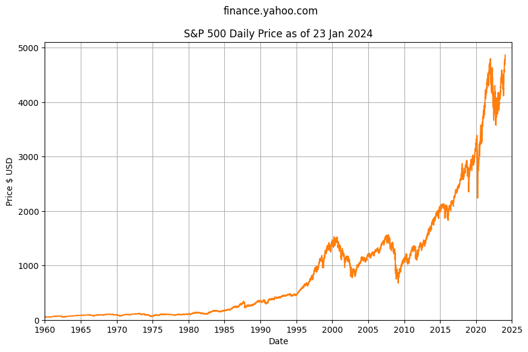

# S&P 500 Index

The S&P 500 Index from Standard & Poor's is a market-capitalization-weighted index of 500 leading publicly traded companies in the US. 

The S&P 500 is widely considered one of the best gauges of overall stock market performance because of its depth and diversity, and because it tracks the top performing companies by market capitalization.

The Year over Year annual price change helps visualize potential investment returns, with the S&P 500 reasonably consistent around +10% YoY but dropping negative during major global financial crisis. The 2020 pandemic event had little impact on the S&P 500 with the leading US companies still able to generate super profits despite supply chain issues.

> The data suggests reasonable confidence using a baseline stock market performance of 10% with some uncertainty or risk that stocks can go up or down for short periods of time. Note this does not take inflation into consideration.

## Chart Data

See Jupyter Notebook [spx-prices.ipynb](https://github.com/mikejonestechno/investment-analytics/notebooks/spx-prices.ipynb).

### Disclaimer

Not financial advice: All content is for educational purposes only. No warranty or guarantee or forward looking statements of fit for purpose; do your own research, etc.