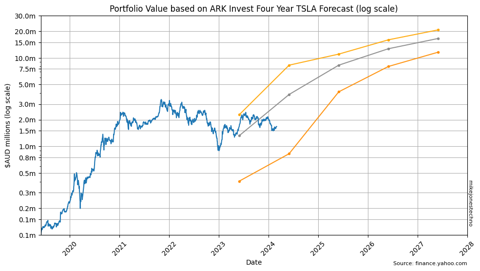

## Dear Elon: An Open Letter

On 7 August 2018 Musks' infamous "funding secured" tweet considered a potential buy back at $420 per share. Given TSLA was trading around $240 a share, that may have seemed a reasonably strong 2x return on investment. 

Two weeks later on 22 August 2018, Ark Invest CEO Cathy Woods published a blog titled "[Dear Elon: An Open Letter Against Taking Tesla Private](https://ark-invest.com/articles/analyst-research/tesla-private/)" in which Cathy explained the enormous disruptive growth potential over a long term (five year) time horizon.

Ark Invest's research and modeling forecast a bear, base and bull case scenario that suggested a 2023 price target somewhere between $700 and $4,000; significantly higher than the suggested $420 offer price, and subsequently a huge financial loss to investors should Tesla become a private company before these forecast gains were realized.

Thankfully for all investors, Tesla remained a public company and ARK Invest continue to publish research on disruptive innovation. Before split adjustments the actual 1 July 2023 price $175 would have been $2,625, close to Ark Invest's five year target base price.

Ark Invest have updated and published four year price targets every year, usually around mid-April.

## Impossible Exponential Growth

In mid 2018 TSLA was trading around $240 a share, and the Ark Invest 2023 price targets of somewhere between $700 and $4,000 seemed ridiculous (pre-split prices). At the time many 'expert' financial analysts claimed this was simply not possible.

The ongoing Ark Invest four year price targets may still seem ridiculous to many 'expert' finanical analysts, especially when plot on a standard chart with the TSLA price targets split adjusted to current prices:

    

    

Exponential growth often requires a long time horizon. The S&P 500 has a consistent median annual growth rate of 12% and the exponential curve is clearly visible over a 50 year time horizon. Plotting the same [SPX Prices on a logarithmic y-axis scale](spx-prices.html) produces a straight line up and to the right. 

Similarly, plotting the [TSLA Prices on a logarithmic y-axis scale](tsla-prices.html) produces a step line up and to the right. 

## Logarithmic Perspective

When evaluating long term exponential growth, a logarithmic scale helps visualize the long term trend.

On a logarithmic y-axis scale the ARK invest four year forecasts appear to be a refined continuation of the existing long term trend.

> ⚠ Disclaimer: _Not financial advice._ All content is for educational purposes only. No warranty or guarantee or forward looking statements of fit for purpose, etc;
do your own research.

    

    

### Disruptive Fundamentals

Beware of the short-term noise of quarterly financials and day-trader 'expert' financial analysts; long term investors research disruptive technology and study the underlying fundamental business proposition.
