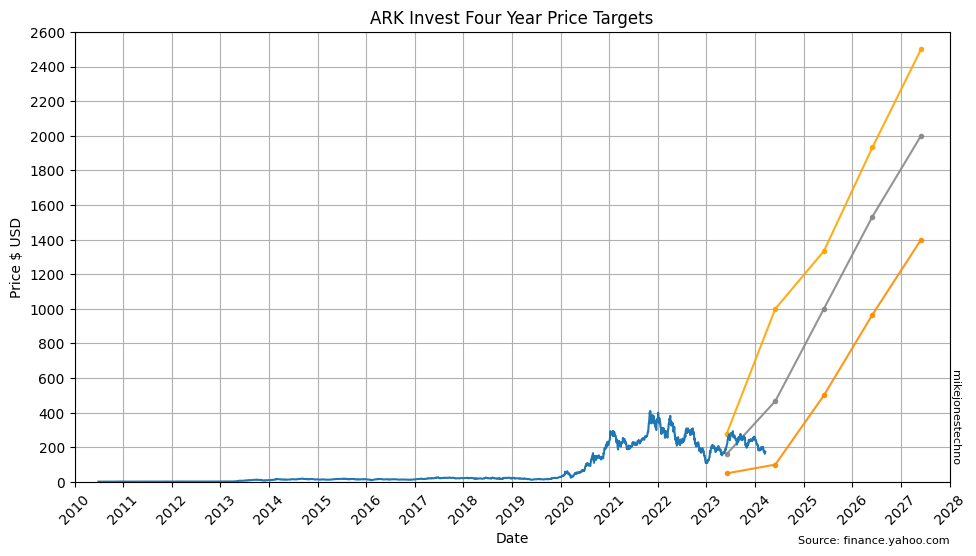
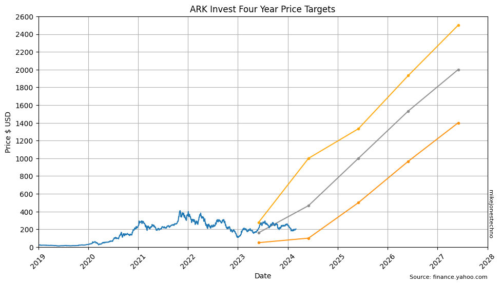
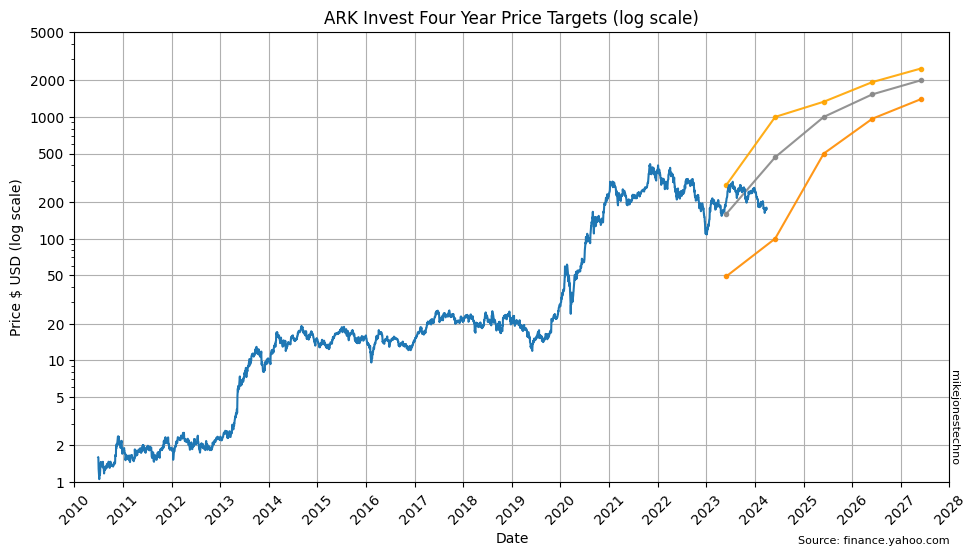

    

    

Rather than zoom in on more recent 2019 I think the growth still looks surreal.
Replace the next chart with a copy of the S&P500 chart of real exponential growth, with context that it occurred over a multi-decade time period with median growth around 12% rather than the 18% that Tesla has to date.

Then a reminder of the S&P 500 log chart that shows a consistent and reasonably predictable straight line trend over multi-decade period. So FOR LONG TERM TRENDS we should show the log chart of Tesla and the ARK forecasts look much more sensible forecasts.

    

    

    

    

## Portfolio View
copy dataframe and multiply all prices by the number of shares held? or just rescale the y axis labels?
# number of shares
share_count = 5384.17

    

    

# Extend the four year forecast to the end of the data
extendFourYear = True
# Show other forecasts (in addition to ARK)
showOther = True

if not showOther:
    dfTargets = dfTargets[dfTargets['Source'] == 'ARKInvest']

dfTargets = dfTargets.sort_values(['Source', 'ForecastDate', 'TargetDate'])

plt.figure(figsize=(10, 6))

grouped = dfTargets.groupby(['Source'])
for name, group in grouped:
    if name[0] == 'ARKInvest':
        line_color = colors['ark']
        line_alpha = 0.9
        line_width = 1.5
    else:
        rng_color = colors['other'].pop(0)
        colors['other'].append(rng_color)
        line_color = {
            'bear': rng_color,
            'base': rng_color,
            'bull': rng_color,
        }
        line_alpha = 0.8
        line_width = 1.0
        print(name[0]+ ' uses ' + rng_color)
            
    # Plot rolling ongoing forecast eg 4 year forecast updated each year
    rolling_forecast = group.drop_duplicates('ForecastDate')

    # Plot extended forecasts that have the same 'ForecastDate'
    extended_forecast = group.groupby(['ForecastDate'])

    for extended_name, subgroup in extended_forecast:
        if subgroup['Base'].notna().sum() > 1:
            if len(rolling_forecast) > 1:
                label_text = None # Hide label for extended forecasts if rolling forecast is also shown
            else:
                label_text = name[0]
            plt.plot(subgroup.index, subgroup['Base'], linestyle='dashed', marker=',', label=label_text, color=line_color['base'], alpha=line_alpha, linewidth=line_width)
        if subgroup['Bear'].notna().sum() > 1:
            subgroup_bear = subgroup.dropna(subset=['Bear'])
            if len(rolling_forecast) > 1:
                label_text = None # Hide label for extended forecasts if rolling forecast is also shown
            else:
                label_text = name[0]+' Bear'
            line_alpha = line_alpha * 0.8
            plt.plot(subgroup_bear.index, subgroup_bear['Bear'], linestyle='dashed', marker=',', label=label_text, color=line_color['bear'], alpha=line_alpha, linewidth=line_width)

    if len(rolling_forecast) > 1:
        if group['Bear'].notna().sum() > 1:
            plt.plot(rolling_forecast.index, rolling_forecast['Bear'], marker='.', label=name[0]+' Bear', color=line_color['bear'], alpha=line_alpha)
        if group['Base'].notna().sum() > 1:
            plt.plot(rolling_forecast.index, rolling_forecast['Base'], marker='.', label=name[0], color=line_color['base'], alpha=line_alpha)
        if group['Bull'].notna().sum() > 1:
            plt.plot(rolling_forecast.index, rolling_forecast['Bull'], marker='.', label=name[0]+' Bull', color=line_color['bull'], alpha=line_alpha)   

plt.plot(df.index, df['Adj Close'], color=colors['tsla'], label='TSLA')
plt.xlabel('Date')
plt.ylabel('$ Price')
plt.suptitle('Rolling Multi Year Price Targets')
plt.title('TSLA Target Forecasts')
plt.yticks(list(range(0, 100000, 1000)))
plt.grid(True)

if extendFourYear:
    right_limit = pd.to_datetime('2032-01-01')
    top_limit = 11000
else:
    right_limit = pd.to_datetime('2028-01-01')
    top_limit = 5000
plt.ylim(bottom=0, top=top_limit) 
plt.xlim(left=pd.to_datetime('2019-01-01'), right=right_limit)

#plt.yscale('linear')
legend = plt.legend(loc='best')
legend.get_frame().set_facecolor('white')
legend.get_frame().set_alpha(0.98)
plt.show()
