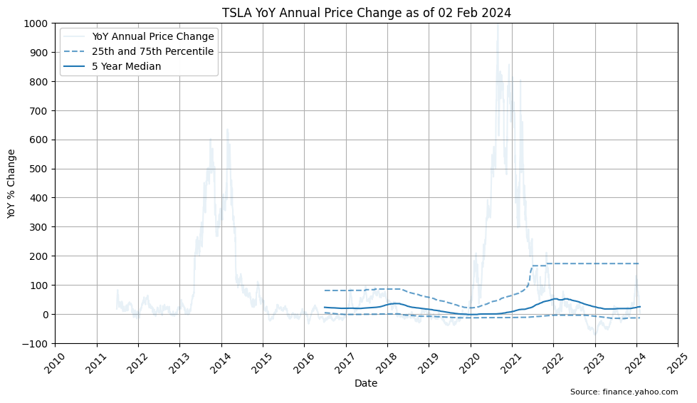
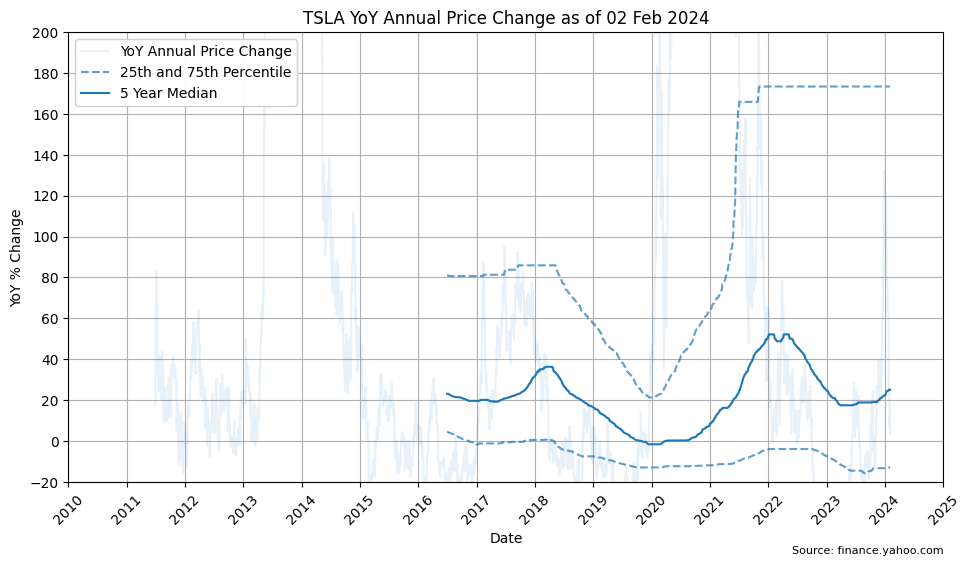

Tesla’s IPO on the NASDAQ was on 29 June 2010. The Tesla share price has extensive periods of high volatility and equally compressed periods of extreme gains.

The share price and "true" market value of the company frequently have a large disconnect, as institutional fund managers focus on "short term" 12 month financial targets, often refusing to place any value on long term growth potential - at least until the profit numbers start showing up in the quarterly financials.

    

    

The compound annual growth over time appears to be exponential growth. Plotting the same data with a logarithmic y-axis scale helps visualize the bursts of growth in earlier years that would otherwise be hidden by the volatility of spikes in later years.

    

    

The logarithmic scale shows the price was slightly increasing from IPO in 2010 to 2013 before a sudden 5x jump between 2013 and 2014 from $2 to $10 (split adjusted).

The jump was likely attributed to the Model S launch in 2012 and the first quarter of profit since the company was founded in 2003. The jump was followed by strong 2x growth in the five year period between 2014 and 2019, before another sudden 10x jump between 2020 and 2012 from $20 to $200 (split adjusted).

The second jump is likely attibuted to the Model 3 production ramp, and the final validation of Tesla as a profitable auto maker at scale, although at this price Tesla exceeds the market capitalization of the top eight global auto makers... combined.

The price has been highly volatile since 2021 generally trending sideways.

For comparison, the high performance S&P 500 Index only shows 5x growth over a ten year or longer period. The 100x growth in ten years from 2011 to 2021 is "rare".

Calculating the 25th and 75th percentile over a multi-year time horizon helps smooth out the anomolies and visualize the lower and upper long term trends.

Over the last 5 years the median (50th percetile) change is 25.15%.

Over the last 10 years the median (50th percetile) change is 18.75%.

| Years | 25th percentile | 50th percentile | 75th percentile |
|-------|-----:|-----:|-----:|
| 1     | -30.42 | -8.04 | 18.79 |
| 5     | -12.77 | 25.15 | 173.34 |
| 10    | -9.46 | 18.75 | 77.21 |

    

    

> ℹ Given the multi-decade history, the data suggests high confidence using a baseline stock market performance of 11.5% with some uncertainty or risk that stocks can go up or down for several years at a time. Note this does not take inflation into consideration.

    

    

