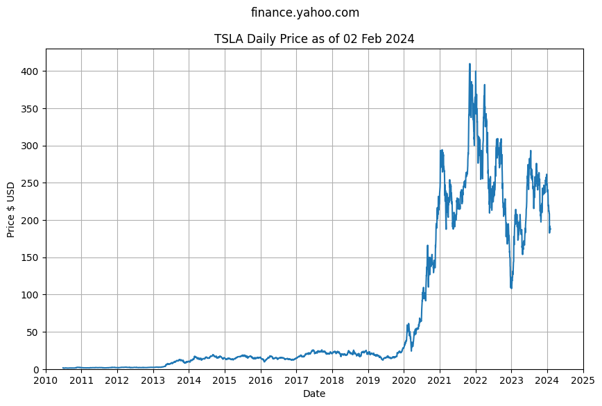
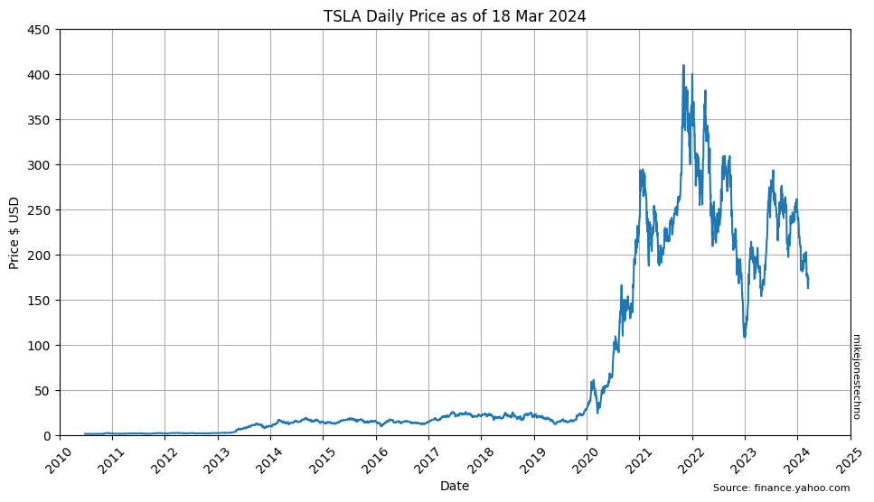
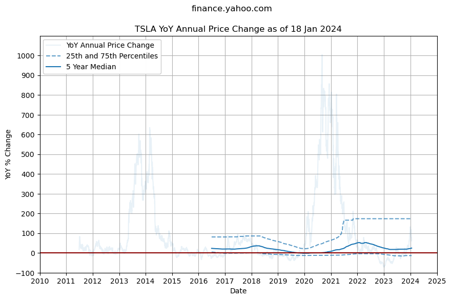
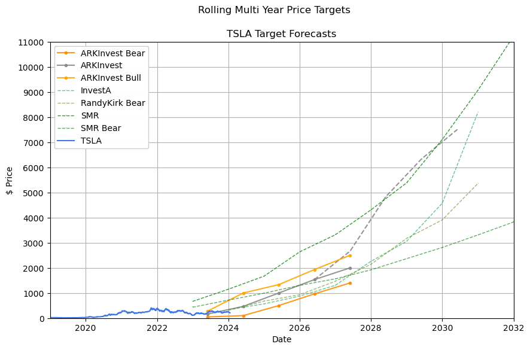

    

    

    

    

Over the last 10 years the median change is 19.03%:
- 25th percentile YoY change is -9.46%
- 50th percentile YoY change is 19.03%
- 75th percentile YoY change is 77.59%

    

    

    /tmp/ipykernel_2055/113867765.py:10: FutureWarning: DataFrame.applymap has been deprecated. Use DataFrame.map instead.
      dfTargets = dfTargets.applymap(lambda x: x.strip() if isinstance(x, str) else x)

    InvestA uses mediumseagreen
    JStephenson uses olivedrab
    RandyKirk uses green
    SMR uses darkgreen

    

    

