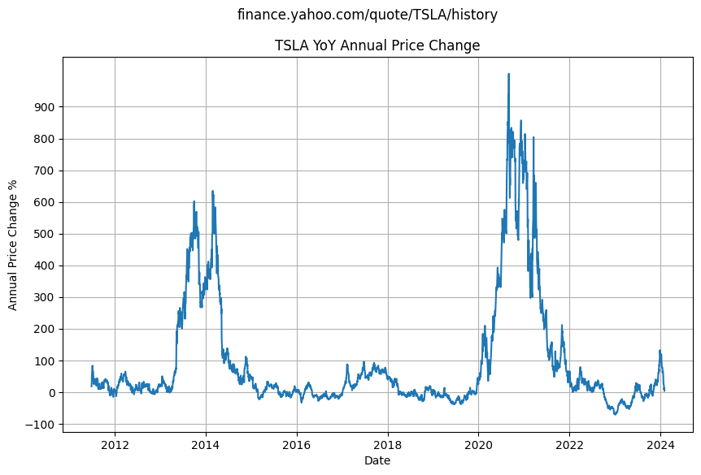
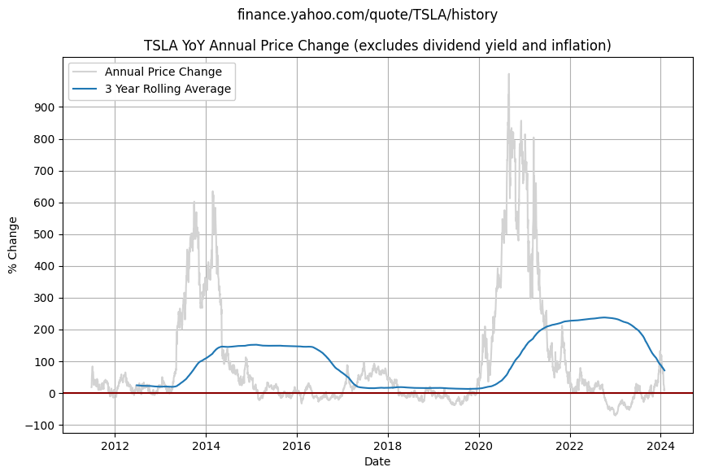
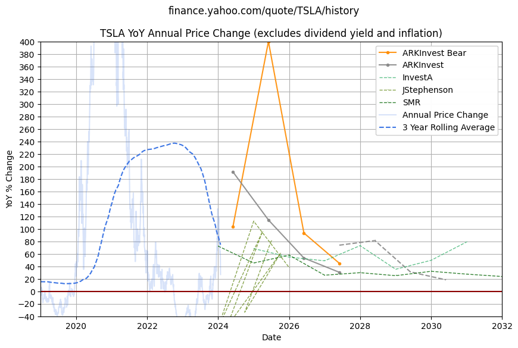

    Using local file

<table border="1" class="dataframe">
  <thead>
    <tr style="text-align: right;">
      <th></th>
      <th>Price</th>
    </tr>
    <tr>
      <th>Date</th>
      <th></th>
    </tr>
  </thead>
  <tbody>
    <tr>
      <th>2010-06-29</th>
      <td>1.592667</td>
    </tr>
    <tr>
      <th>2010-06-30</th>
      <td>1.588667</td>
    </tr>
    <tr>
      <th>2010-07-01</th>
      <td>1.464000</td>
    </tr>
    <tr>
      <th>2010-07-02</th>
      <td>1.280000</td>
    </tr>
    <tr>
      <th>2010-07-06</th>
      <td>1.074000</td>
    </tr>
  </tbody>
</table>

<table border="1" class="dataframe">
  <thead>
    <tr style="text-align: right;">
      <th></th>
      <th>Price</th>
      <th>Change</th>
    </tr>
    <tr>
      <th>Date</th>
      <th></th>
      <th></th>
    </tr>
  </thead>
  <tbody>
    <tr>
      <th>2024-01-25</th>
      <td>182.630005</td>
      <td>26.923349</td>
    </tr>
    <tr>
      <th>2024-01-26</th>
      <td>183.250000</td>
      <td>26.878079</td>
    </tr>
    <tr>
      <th>2024-01-29</th>
      <td>190.929993</td>
      <td>19.130210</td>
    </tr>
    <tr>
      <th>2024-01-30</th>
      <td>191.589996</td>
      <td>7.695336</td>
    </tr>
    <tr>
      <th>2024-01-31</th>
      <td>187.289993</td>
      <td>12.378488</td>
    </tr>
  </tbody>
</table>

    

    

<table border="1" class="dataframe">
  <thead>
    <tr style="text-align: right;">
      <th></th>
      <th>Price</th>
      <th>Change</th>
      <th>3_yr_rolling</th>
    </tr>
    <tr>
      <th>Date</th>
      <th></th>
      <th></th>
      <th></th>
    </tr>
  </thead>
  <tbody>
    <tr>
      <th>2024-01-25</th>
      <td>182.630005</td>
      <td>26.923349</td>
      <td>74.576156</td>
    </tr>
    <tr>
      <th>2024-01-26</th>
      <td>183.250000</td>
      <td>26.878079</td>
      <td>73.712612</td>
    </tr>
    <tr>
      <th>2024-01-29</th>
      <td>190.929993</td>
      <td>19.130210</td>
      <td>72.823537</td>
    </tr>
    <tr>
      <th>2024-01-30</th>
      <td>191.589996</td>
      <td>7.695336</td>
      <td>71.957816</td>
    </tr>
    <tr>
      <th>2024-01-31</th>
      <td>187.289993</td>
      <td>12.378488</td>
      <td>71.155445</td>
    </tr>
  </tbody>
</table>

    

    

    /tmp/ipykernel_1983/1678989774.py:10: FutureWarning: DataFrame.applymap has been deprecated. Use DataFrame.map instead.
      dfTargets = dfTargets.applymap(lambda x: x.strip() if isinstance(x, str) else x)

    /tmp/ipykernel_1983/3110887510.py:11: FutureWarning: The default fill_method='pad' in Series.pct_change is deprecated and will be removed in a future version. Either fill in any non-leading NA values prior to calling pct_change or specify 'fill_method=None' to not fill NA values.
      subgroup['BearChange'] = subgroup['Bear'].pct_change() * 100 # change since previous row
    /tmp/ipykernel_1983/3110887510.py:11: FutureWarning: The default fill_method='pad' in Series.pct_change is deprecated and will be removed in a future version. Either fill in any non-leading NA values prior to calling pct_change or specify 'fill_method=None' to not fill NA values.
      subgroup['BearChange'] = subgroup['Bear'].pct_change() * 100 # change since previous row
    /tmp/ipykernel_1983/3110887510.py:11: FutureWarning: The default fill_method='pad' in Series.pct_change is deprecated and will be removed in a future version. Either fill in any non-leading NA values prior to calling pct_change or specify 'fill_method=None' to not fill NA values.
      subgroup['BearChange'] = subgroup['Bear'].pct_change() * 100 # change since previous row
    /tmp/ipykernel_1983/3110887510.py:10: FutureWarning: The default fill_method='pad' in Series.pct_change is deprecated and will be removed in a future version. Either fill in any non-leading NA values prior to calling pct_change or specify 'fill_method=None' to not fill NA values.
      subgroup['BaseChange'] = subgroup['Base'].pct_change() * 100 # change since previous row
    /tmp/ipykernel_1983/3110887510.py:11: FutureWarning: The default fill_method='pad' in Series.pct_change is deprecated and will be removed in a future version. Either fill in any non-leading NA values prior to calling pct_change or specify 'fill_method=None' to not fill NA values.
      subgroup['BearChange'] = subgroup['Bear'].pct_change() * 100 # change since previous row

<table border="1" class="dataframe">
  <thead>
    <tr style="text-align: right;">
      <th></th>
      <th>Year</th>
      <th>Source</th>
      <th>Bear</th>
      <th>Base</th>
      <th>Bull</th>
      <th>ForecastDate</th>
      <th>TargetDate</th>
      <th>Note</th>
      <th>Link</th>
    </tr>
    <tr>
      <th>Date</th>
      <th></th>
      <th></th>
      <th></th>
      <th></th>
      <th></th>
      <th></th>
      <th></th>
      <th></th>
      <th></th>
    </tr>
  </thead>
  <tbody>
    <tr>
      <th>2022-12-31</th>
      <td>2022</td>
      <td>SMR</td>
      <td>434.000000</td>
      <td>666.000000</td>
      <td>NaN</td>
      <td>2022-03-21</td>
      <td>31/12/2022</td>
      <td>1998 weighted average PT, although 1713 is bas...</td>
      <td>[Link](https://www.youtube.com/watch?v=W0OKbs_...</td>
    </tr>
    <tr>
      <th>2023-12-31</th>
      <td>2023</td>
      <td>SMR</td>
      <td>715.666667</td>
      <td>1148.333333</td>
      <td>NaN</td>
      <td>2022-03-21</td>
      <td>31/12/2023</td>
      <td>given these all forecast at same time, plot th...</td>
      <td>NaN</td>
    </tr>
    <tr>
      <th>2024-12-31</th>
      <td>2024</td>
      <td>SMR</td>
      <td>992.000000</td>
      <td>1668.333333</td>
      <td>NaN</td>
      <td>2022-03-21</td>
      <td>31/12/2024</td>
      <td>NaN</td>
      <td>NaN</td>
    </tr>
    <tr>
      <th>2025-12-31</th>
      <td>2025</td>
      <td>SMR</td>
      <td>1303.333333</td>
      <td>2635.333333</td>
      <td>NaN</td>
      <td>2022-03-21</td>
      <td>31/12/2025</td>
      <td>NaN</td>
      <td>NaN</td>
    </tr>
    <tr>
      <th>2026-12-31</th>
      <td>2026</td>
      <td>SMR</td>
      <td>1563.333333</td>
      <td>3315.333333</td>
      <td>NaN</td>
      <td>2022-03-21</td>
      <td>31/12/2026</td>
      <td>NaN</td>
      <td>NaN</td>
    </tr>
    <tr>
      <th>2027-12-31</th>
      <td>2027</td>
      <td>SMR</td>
      <td>1920.333333</td>
      <td>4305.666667</td>
      <td>4305.666667</td>
      <td>2022-03-21</td>
      <td>31/12/2027</td>
      <td>NaN</td>
      <td>NaN</td>
    </tr>
    <tr>
      <th>2028-12-31</th>
      <td>2028</td>
      <td>SMR</td>
      <td>NaN</td>
      <td>5384.000000</td>
      <td>NaN</td>
      <td>2022-03-21</td>
      <td>31/12/2028</td>
      <td>NaN</td>
      <td>NaN</td>
    </tr>
    <tr>
      <th>2029-12-31</th>
      <td>2029</td>
      <td>SMR</td>
      <td>2812.000000</td>
      <td>7110.666667</td>
      <td>NaN</td>
      <td>2022-03-21</td>
      <td>31/12/2029</td>
      <td>NaN</td>
      <td>NaN</td>
    </tr>
    <tr>
      <th>2030-12-31</th>
      <td>2030</td>
      <td>SMR</td>
      <td>3310.000000</td>
      <td>9067.000000</td>
      <td>NaN</td>
      <td>2022-03-21</td>
      <td>31/12/2030</td>
      <td>NaN</td>
      <td>NaN</td>
    </tr>
    <tr>
      <th>2031-12-31</th>
      <td>2031</td>
      <td>SMR</td>
      <td>3825.333333</td>
      <td>11219.666667</td>
      <td>NaN</td>
      <td>2022-03-21</td>
      <td>31/12/2031</td>
      <td>NaN</td>
      <td>NaN</td>
    </tr>
  </tbody>
</table>

    /tmp/ipykernel_1983/3440364386.py:58: SettingWithCopyWarning: 
    A value is trying to be set on a copy of a slice from a DataFrame.
    Try using .loc[row_indexer,col_indexer] = value instead
    
    See the caveats in the documentation: https://pandas.pydata.org/pandas-docs/stable/user_guide/indexing.html#returning-a-view-versus-a-copy
      rolling_forecast['BearChange'] = rolling_forecast['Bear'].pct_change() * 100 # change since previous row
    /tmp/ipykernel_1983/3440364386.py:61: SettingWithCopyWarning: 
    A value is trying to be set on a copy of a slice from a DataFrame.
    Try using .loc[row_indexer,col_indexer] = value instead
    
    See the caveats in the documentation: https://pandas.pydata.org/pandas-docs/stable/user_guide/indexing.html#returning-a-view-versus-a-copy
      rolling_forecast['BaseChange'] = rolling_forecast['Base'].pct_change() * 100 # change since previous row

    InvestA uses mediumseagreen
    JStephenson uses olivedrab
    RandyKirk uses green
    SMR uses darkgreen

    

    

