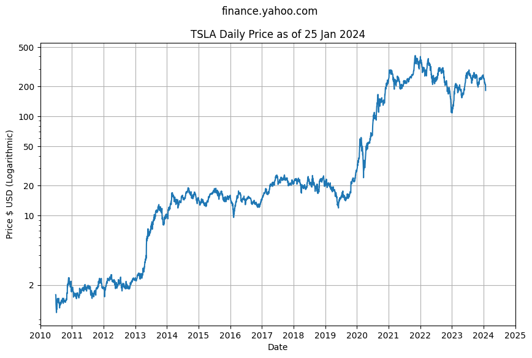

Tesla's IPO on the NASDAQ was on 29 June 2010. The Tesla share price has had extensive periods of high volatility and equally compressed periods of extreme gains. 

The share price and true market value of the company frequently have a large disconnect, as institutional fund managers focus on "short term" 12 month trading and are unable to place a value on long term growth potential - until the profit numbers start showing up in the quartly financials. 

Tesla's growth has never been seen before in the automotive industy. Note: Tesla was never "just a car company".

The share price is far from a straight line - or any regular curve. Plotting the same data with a logarithmic y-axis scale helps visualize the bursts of growth in earlier years that are otherwise be hidden by the volatility of spikes in later years.

The logarithmic scale shows the price was slightly increasing from IPO in 2010 to 2013 before a sudden 5x jump from $2 to $10 (split adjusted) in 2013. 

The jump was likely attributed to the Model S launch in 2012 and the first quarter of profit since the company was founded. The jump was followed by strong 2x growth in the five year period between 2014 and 2019, before another sudden 10x jump from $20 to $200 (split adjusted) in 2020.

The second jump is likely attibuted to the Model 3 production ramp, and the final validation of Tesla as a profitable auto maker at scale, although at this price Tesla exceeds the market capitalization of the top eight global auto makers... combined.

 The price has been highly volatile since 2021 generally trending sideways over the last three years.

For comparison, the high performance S&P 500 Index only shows 5x growth over a ten year or longer period. The 100x growth in ten years from 2011 to 2021 is "rare".

Plotting the Year over Year annual price change helps visualize potential investment returns. Since Tesla IPO in 2010 we have a relatively short 20 year history to evaluate, with extreme variation between +800% and -20%, with occasional spikes outside this range.

Over a five year time horizon the YoY annual price change is between -13% and 173% at the 25th and 75th percentile with the median YoY price change 24.41%.

- 25th percentile YoY change is -13.25%
- 50th percentile YoY change is 24.41%
- 75th percentile YoY change is 173.34%

Over the last ten years the variation is considerably narrower:

- 25th percentile YoY change is -9.46%
- 50th percentile YoY change is 19.03%
- 75th percentile YoY change is 78.69%

> ℹ The data suggests a reasonable "conservative" baseline of 20% over a multi-decade time horizon, with some uncertainty or risk that the price can go significantly higher or lower for short periods of time. Note this does not take inflation into consideration.

## Chart Data

See Jupyter Notebook [spx-prices.ipynb](https://github.com/mikejonestechno/investment-analytics/blob/main/notebooks/spx-prices.ipynb).