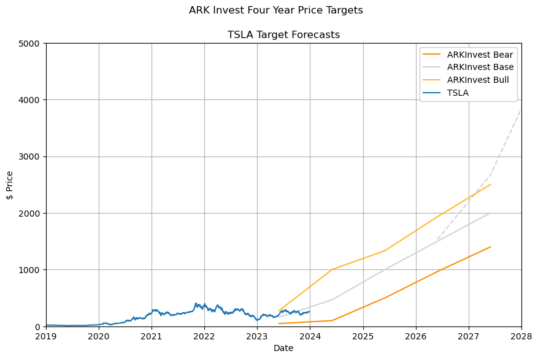

# Python Jupyter Notebooks for Investment Retirement Data Analytics

These experimental jupyter notebooks plot inflation, interest rate and SPX 500 index to help visualize investment and retirement portfolios.

> If you already have VS Code and Docker installed, you can click the badge above to get started. Clicking this link will cause VS Code to automatically install the Dev Containers extension if needed, clone the source code into a container volume, and spin up a dev container for use.

  

[GitHub Actions](https://github.com/mikejonestechno/investment-analytics/actions/workflows/ci.yaml) trigger a devops CI pipeline on every PR and code quality is automatically scanned and published on [SonarCloud](https://sonarcloud.io/summary/overall?id=mikejonestechno_investment-analytics). Although SonarQube can scan python files for code quality, it does not currently support python code in Jupyter notebook files.

## [Investment Analytics GitHub Pages](https://mikejonestechno.github.io/investment-analytics/)

View all the charts in this data-analytics project at 
[https://mikejonestechno.github.io/investment-analytics/](https://mikejonestechno.github.io/investment-analytics/)

### Examples

1. [Inflation and Interest Rates](https://mikejonestechno.github.io/investment-analytics/inflation-and-interest-rates.html) chart from Jupyter notebook. 

2. [TSLA Prices](notebooks/inflation-and-interest-rates.ipynb) chart with ArkInvest four year targets from Jupyter notebook. 

### Disclaimer

Not financial advice: All content of this repository is for educational purposes only. No warranty or guarantee or forward looking statements of fit for purpose; do your own research, etc.

## Australian Index Data

The interest rates and inflation rates are obtained from https://www.rba.gov.au/statistics.

The data for interest rates will be downloaded to `.\notebooks\data\f5-data.csv`.

The data for inflation rates will be downloaded to `.\notebooks\data\g1-data.csv`.

## International Index Data

Historical prices (adjusted for splits and dividend and/or capital gain distributions) obtained from https://finance.yahoo.com/quote/TSLA/history.

The data will be downloaded to `.\notebooks\data\tsla_HistoricalData.csv`.