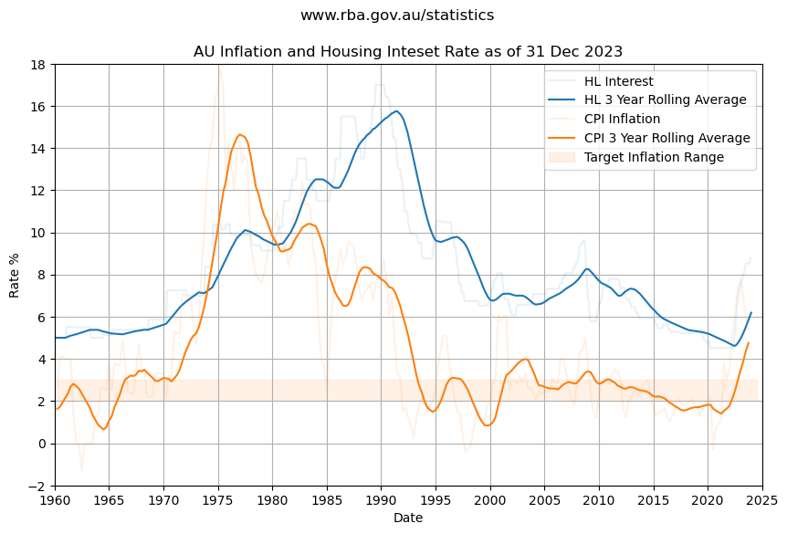

# Python Jupyter Notebooks for Investment Retirement Data Analytics

> If you already have VS Code and Docker installed, you can click the badge above to get started. Clicking this link will cause VS Code to automatically install the Dev Containers extension if needed, clone the source code into a container volume, and spin up a dev container for use.

These experimental jupyter notebooks plot inflation, interest rate and SPX 500 index to help visualize investment and retirement portfolios.

 

Code Quality automatically scanned and published on SonarCloud.

## Example

[Inflation and Interest Rates](notebooks/finance/inflation-and-interest-rates.ipynb) chart from Jupyter notebook. 

## Australian Index Data

The interest rates and inflation rates are obtained from https://www.rba.gov.au/statistics.

The data for interest rates will be downloaded to `.\notebooks\data\f5-data.csv`.
The data for inflation rates will be downloaded to `.\notebooks\data\g1-data.csv`.

## International Index Data

The S&P 500 (SPX) daily price data can be manually downloaded from https://www.nasdaq.com/market-activity/index/spx/historical.

Select the max (10 year) date range and save the file as `.\notebooks\data\spx_HistoricalData.csv`.

The S&P 500 (SPX) monthly price data from 1959 can be downloaded from [expired link].
